<p align="center">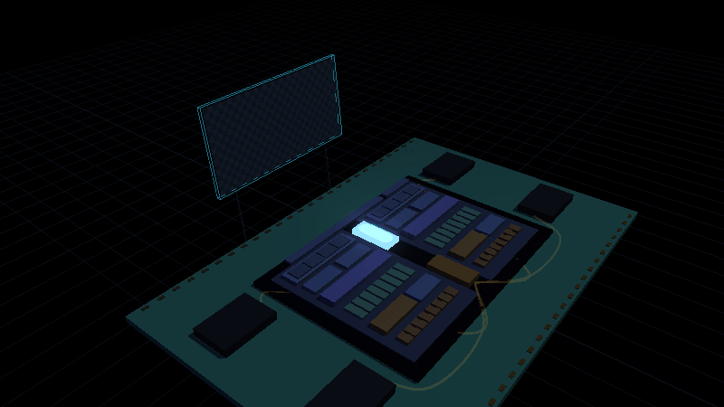</p>

<h1 align="center">Pixelstorm</h1>
<p align="center"><b>An open-source GPU you can watch paint.</b><br>
A complete GPU in Verilog that renders shaders, triangles and fractals, placed as real SkyWater 130 nm silicon, with a 3D chip explorer, a cycle-by-cycle visualizer, six interactive labs and a 17-chapter course.</p>

<p align="center">
<a href="https://normansrule.github.io/pixelstorm-gpu/"><b>Website</b></a> &nbsp;|&nbsp;
<a href="https://normansrule.github.io/pixelstorm-gpu/chip.html"><b>3D chip explorer</b></a> &nbsp;|&nbsp;
<a href="https://normansrule.github.io/pixelstorm-gpu/silicon.html"><b>Silicon</b></a> &nbsp;|&nbsp;
<a href="https://normansrule.github.io/pixelstorm-gpu/visualizer.html?tour">Guided tour</a> &nbsp;|&nbsp;
<a href="https://normansrule.github.io/pixelstorm-gpu/labs.html">Labs</a> &nbsp;|&nbsp;
<a href="docs/00-start-here.md">Course</a>
</p>

---

## What it is

A GPU (Graphics Processing Unit) draws an image by running one small program on every pixel at once: a storm of threads, grouped into warps that march in lockstep through the same instructions. Pixelstorm is that machine, small enough to read in an afternoon and complete enough to render the images below. Every pixel was computed by the Verilog in `rtl/` and checked against a cycle-exact golden model and an independent CPU renderer.

<p align="center"></p>

## Four ways in, all in the browser

| | | |
|---|---|---|
| **[3D chip explorer](https://normansrule.github.io/pixelstorm-gpu/chip.html)** | The die in 3D, replaying real RTL traces: lanes glow as they execute, memory requests fly to DRAM, the framebuffer paints overhead, and a telemetry panel tracks IPC (Instructions Per Cycle) and SIMD (Single Instruction, Multiple Data) efficiency. Click any block for what it does, its Verilog file and its chapter. | 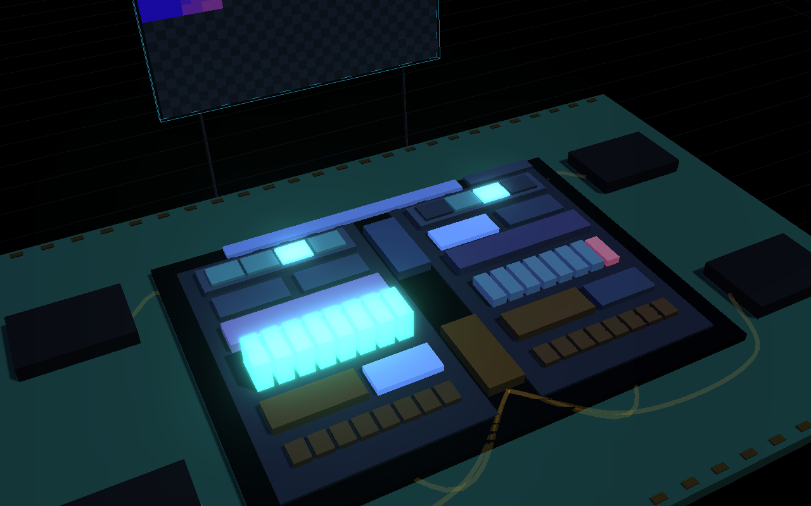 |
| **[Visualizer](https://normansrule.github.io/pixelstorm-gpu/visualizer.html?tour)** | Both SMs (Streaming Multiprocessors) as live block diagrams, per-lane values, registers, memory, a framebuffer and a timeline. Twelve-stop guided tour. Edit a kernel and re-run it in the page. | 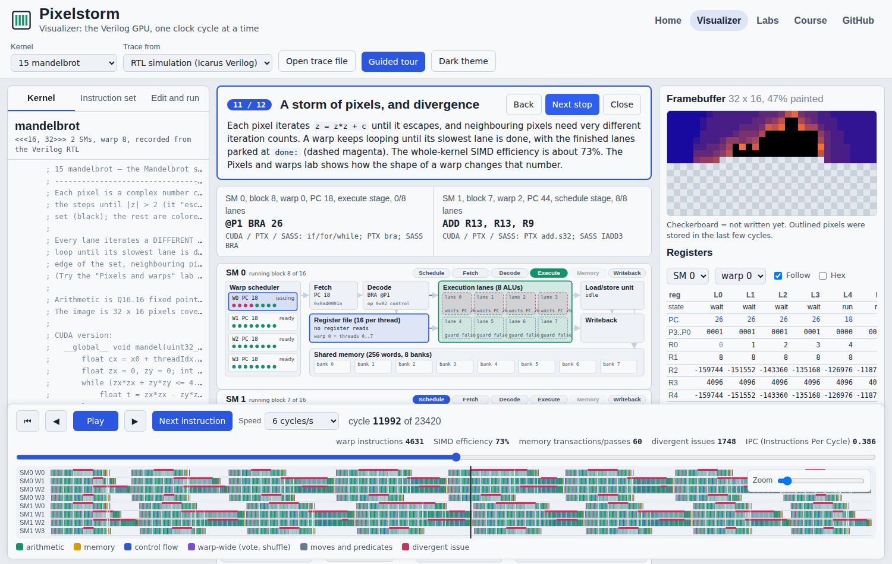 |
| **[Labs](https://normansrule.github.io/pixelstorm-gpu/labs.html)** | Six experiments with sliders: coalescing, bank conflicts, divergence, latency hiding, occupancy (real H100, A100 and RTX 30-series limits), pixels and warps. | 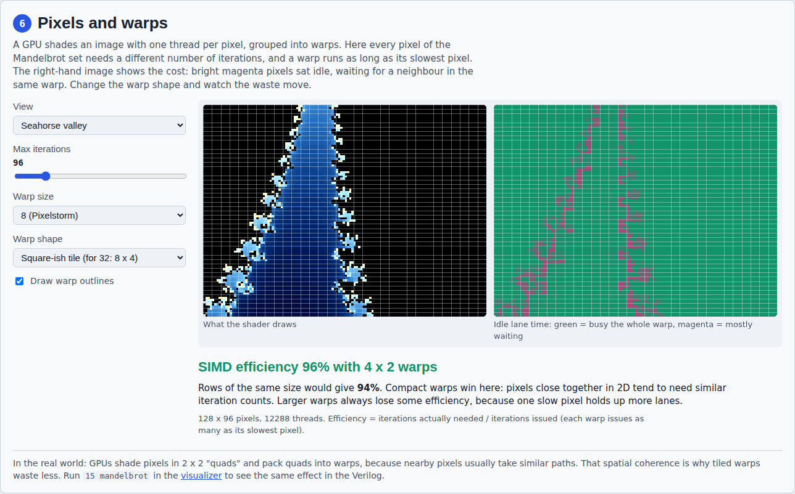 |
| **[Home page](https://normansrule.github.io/pixelstorm-gpu/)** | The hero is a live pixel shader running on your own GPU; scroll through the story of one instruction becoming 512 pixels, and scrub through three framebuffers the Verilog rendered. | 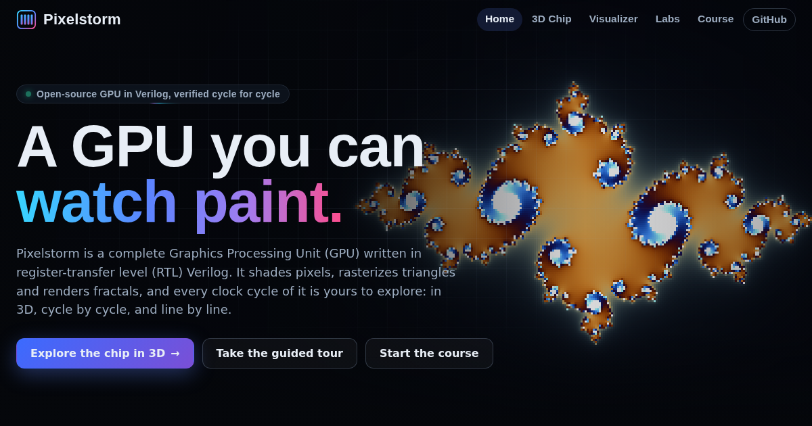 |

## What is inside

| | |
|---|---|
| **Real hardware** | About 980 lines of commented Verilog: 2 SMs with 4 warps of 8 lanes, a warp scheduler with per-thread PCs, a coalescing load/store unit, 8-bank shared memory, barriers, shuffles, votes and atomics. Synthesizes with Yosys. |
| **Graphics** | A framebuffer (`.fb`), a gradient pixel shader, a triangle rasterizer built on edge functions with barycentric color, and the Mandelbrot set in Q16.16 fixed point. |
| **A CUDA-style ISA** | 40 instructions, each mapped to the CUDA, PTX or SASS operation it imitates. `./pixelstorm explain SHFL` |
| **15 example kernels** | vector add, SAXPY, divergence, reductions, histogram, matrix multiply, coalescing, bank conflicts, vote, scan, image threshold, and the three graphics kernels. |
| **Proof it is right** | `./pixelstorm test`: every kernel on 1 and 2 SMs, RTL and model agree on every commit and every memory word, and the answer matches a CPU. |
| **Silicon** | SkyWater 130 nm synthesis, a placed GDS layout, KLayout renders and 3D standard cells. |
| **Course** | 17 chapters in five parts with figures drawn from real traces and "check yourself" questions. |

## From Verilog to silicon

The same Verilog, synthesized with Yosys into real **SkyWater 130 nm** standard cells, placed row by row into a GDS (Graphic Design System) layout and rendered by KLayout. One command, about two minutes:

```bash
make silicon      # PDK download, synthesis, placement, GDS, KLayout pictures
make gds          # open build/silicon/ps_s130.gds in KLayout (Display, Full Hierarchy)
```

| | |
|---|---|
| Standard cells | **129,171** (10,592 flip-flops) plus 137,468 tap, decap and filler cells |
| Transistors | **1,367,810**, counted from the layout |
| Die | 1672.04 x 1458.24 µm = **2.438 mm²**, 57.7% utilization |
| Status | placed, not yet routed: clock tree, routing and sign-off are the OpenLane exercise in [chapter 14](docs/14-silicon.md) |

| The die (KLayout) | Floorplan | 9 µm: single transistors |
|---|---|---|
| 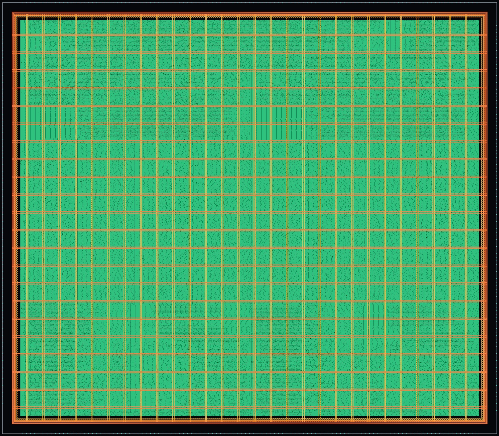 | 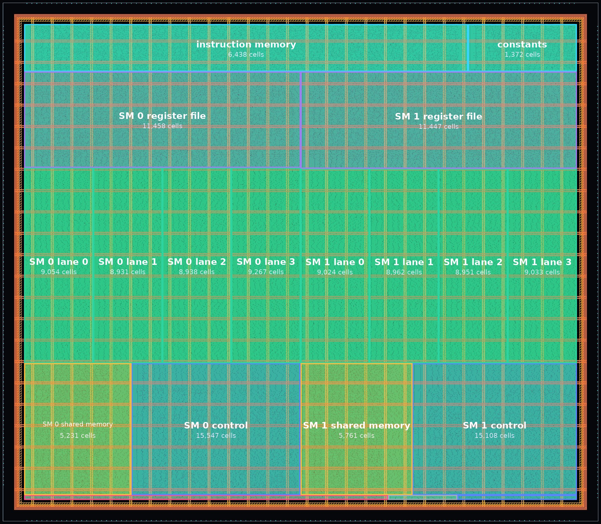 | 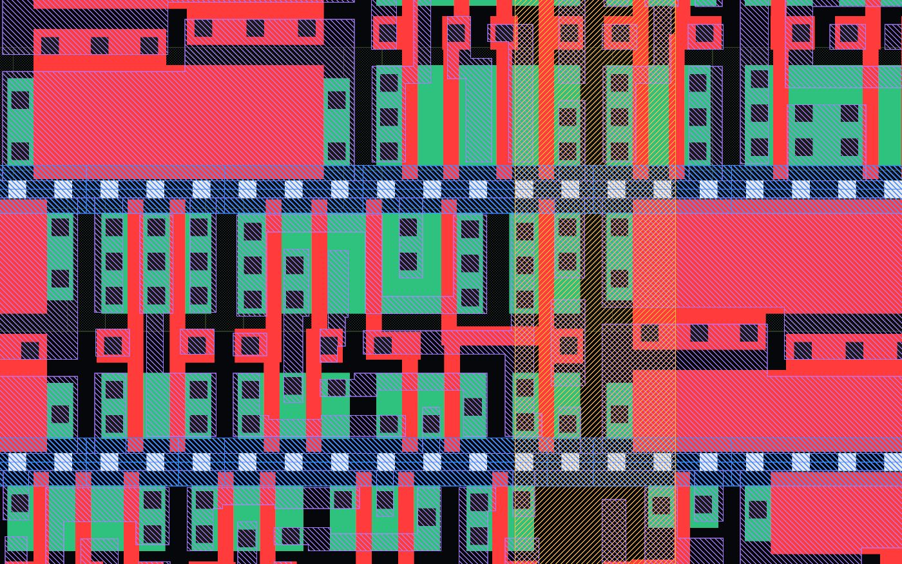 |

| NAND2 (4 transistors) | Full adder (28) | D flip-flop (24) |
|---|---|---|
| 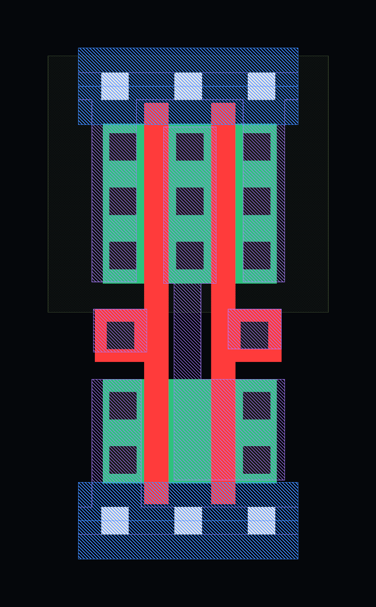 | 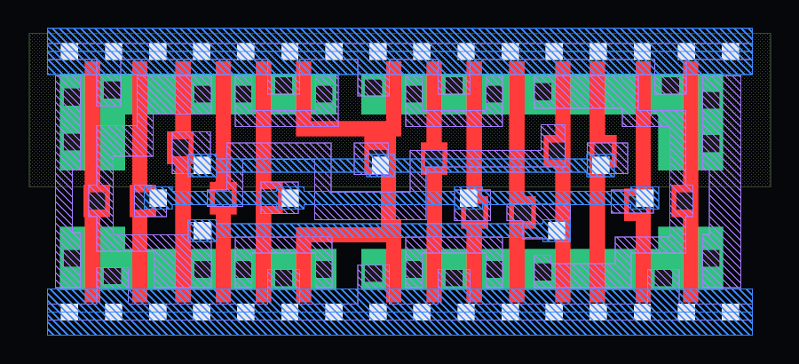 | 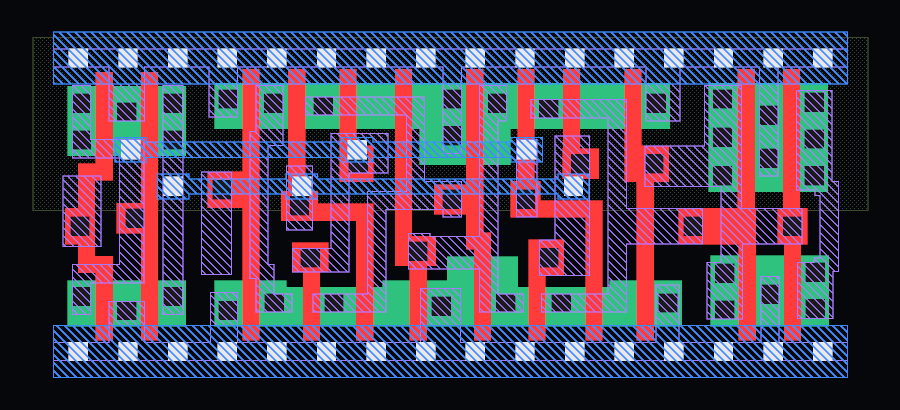 |

Every release carries the GDS as a download (built by `.github/workflows/silicon.yml`), and the [silicon page](https://normansrule.github.io/pixelstorm-gpu/silicon.html) lets you dive from the die to a transistor and spin real sky130 gates in 3D.

## The course

| Part | Chapters |
|---|---|
| **1. Concepts** | [1 What a GPU is](docs/01-what-is-a-gpu.md), [2 SIMT: threads, warps and blocks](docs/02-simt-warps-blocks.md), [3 The instruction set](docs/03-isa.md) |
| **2. The hardware** | [4 Microarchitecture](docs/04-microarchitecture.md), [5 Life of one instruction](docs/05-instruction-lifecycle.md), [6 Reading the RTL](docs/06-reading-the-rtl.md) |
| **3. Performance** | [7 Divergence](docs/07-divergence.md), [8 Memory: coalescing and banks](docs/08-memory.md), [9 Synchronization](docs/09-synchronization.md) |
| **4. Applications and graphics** | [10 Applications](docs/10-applications.md), [11 Graphics: pixels, triangles and fractals](docs/11-graphics.md) |
| **5. Build on it** | [12 Make it better](docs/12-make-it-better.md), [13 From Pixelstorm to a real GPU](docs/13-real-world-gpus.md), [14 From Verilog to silicon](docs/14-silicon.md) |
| **Appendix** | [15 References](docs/15-references.md), [16 Glossary](docs/16-glossary.md), [17 Troubleshooting](docs/17-troubleshooting.md) |

| | |
|---|---|
|  |  |
| How a triangle is rasterized: three edge functions per pixel | Why the Mandelbrot set is the poster child for divergence |
| 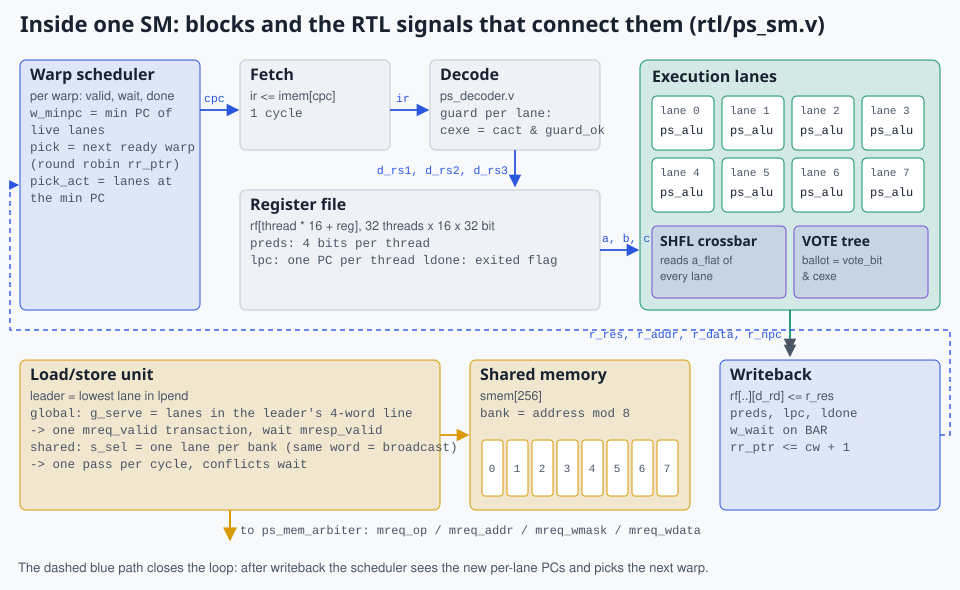 | 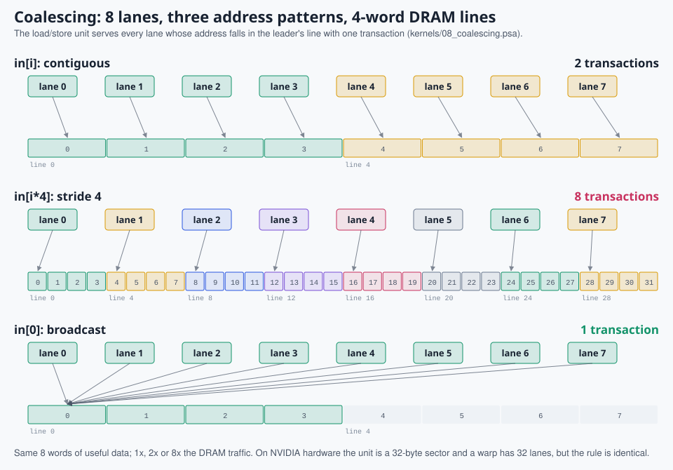 |
| Inside one SM, labeled with the RTL signal names | Coalescing: 2, 8 or 1 memory transactions |

## Run it on your machine

Ubuntu, or Windows through WSL2 (Windows Subsystem for Linux):

```bash
git clone https://github.com/Normansrule/pixelstorm-gpu.git
cd pixelstorm-gpu
bash scripts/setup_ubuntu.sh             # Icarus Verilog, Verilator, GTKWave, Yosys, Node.js

./pixelstorm list                        # the 15 kernels
./pixelstorm sim mandelbrot              # golden model, instant
./pixelstorm rtl mandelbrot --vcd        # the real Verilog, plus a waveform
./pixelstorm test                        # RTL == model, cycle for cycle, every kernel
make serve                               # website: home, 3D chip, visualizer, labs at localhost:8000
```

Write your own shader:

```bash
./pixelstorm new circle                  # kernels/16_circle.psa from a template
# add ".fb FB, 32, 32" and compute a color per pixel
./pixelstorm sim circle && ./pixelstorm rtl circle
make traces                              # now it paints in the visualizer too
```

## Repository map

```
rtl/          the GPU in Verilog: ps_sm.v (the SM), ps_alu.v, ps_decoder.v,
              ps_dispatcher.v, ps_mem_arbiter.v, ps_gpu_top.v, ps_defines.vh
sim/          testbench with host driver and DRAM model; GTKWave view
kernels/      15 example kernels (.psa = Pixelstorm assembly)
web/          website: index (home), chip (3D explorer), silicon, visualizer, labs
              js/pixelstorm.js = assembler + golden model, js/replay.js = trace replay,
              js/ui.js + css/ui.css = animated components, vendor/ = three.js and GSAP
tools/        pixelstorm.js (the CLI), figures.js (docs/img), site_data.js (web/data),
              silicon/ = synth.ys, place.py, render.py (RTL -> sky130 GDS -> KLayout pictures),
              course.py and rtl_chapter.py (docs), record_chip.py (the README animation)
tests/        independent answer checks, including CPU renderers for the images
docs/         the course; docs/img/ figures are generated from simulation traces
```

`make all` runs the tests, records fresh traces, redraws every figure and rebuilds the course pages. Change the hardware, run it, and the documentation follows.

## Contributing

Change `rtl/ps_sm.v` and `web/js/pixelstorm.js` together: `./pixelstorm test` compares them cycle for cycle and names the first cycle where they differ. New kernels go in `kernels/` with an answer check in `tests/expected.js`. Good first contributions: the exercises in [chapter 12](docs/12-make-it-better.md) and the graphics exercises in [chapter 11](docs/11-graphics.md) (a depth buffer, the top-left fill rule, a circle shader).

## License

MIT. See [LICENSE](LICENSE).
