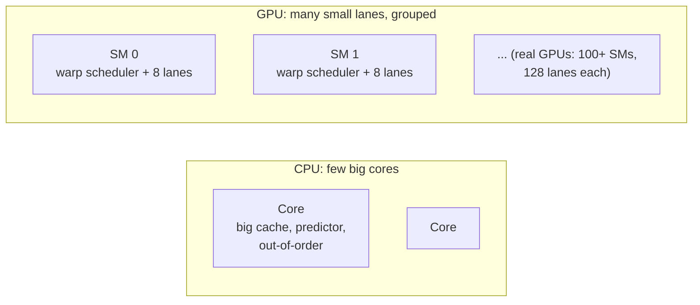

# 1. What a GPU is

> **Part 1: Concepts**, chapter 1 of 16. About 10 minutes.

**In this chapter you will learn**

- why a GPU spends its transistors on arithmetic instead of caches and prediction
- the three ideas that explain every GPU: many threads, shared instruction streams, latency hiding
- how Pixelstorm compares with a real data-center GPU

**See it live:** [Home page animation](https://normansrule.github.io/pixelstorm-gpu/); [Guided tour, stop 1](https://normansrule.github.io/pixelstorm-gpu/visualizer.html?tour)

---

A Central Processing Unit (CPU) is built to finish **one** thread of work as fast as possible. It spends most of its transistors on things that reduce latency: big caches, branch predictors, out-of-order execution.

A Graphics Processing Unit (GPU) is built to finish **a huge number** of independent pieces of work per second. It spends its transistors on arithmetic units instead, and it hides slow memory by always having some other work ready to run.

## Three ideas explain almost everything

**1. Many threads run the same program.** A kernel such as `C[i] = A[i] + B[i]` is launched on thousands of threads, each with its own `i`. There is no loop over `i` in the code; the loop is the hardware.

**2. Threads are bundled into warps that share one instruction stream.** Fetching and decoding an instruction is expensive. A GPU does it once for a group of threads (32 on NVIDIA, 8 in Pixelstorm) and feeds the same decoded instruction to every lane. That is Single Instruction, Multiple Threads (SIMT). The price: when threads in a warp want to do different things (an `if`), some lanes sit idle. See [07-divergence.md](07-divergence.md).

**3. Memory is slow, so the GPU switches work instead of waiting.** A DRAM (Dynamic Random-Access Memory) access takes hundreds of cycles on a real GPU. Instead of stalling, the warp scheduler runs another warp. Pixelstorm deliberately does *not* do this yet so you can see the cost clearly; adding it is exercise 2 in [12-make-it-better.md](12-make-it-better.md).

## Where GPUs are used

| Domain | Why it maps well | Pixelstorm kernel that shows the pattern |
|---|---|---|
| Graphics shading | One thread per pixel, mostly branch-free | `12_threshold_image` |
| Deep learning | Matrix multiply dominates | `07_matmul` |
| Scientific computing | Vector and stencil operations | `01_vector_add`, `02_saxpy_fixed` |
| Data analytics | Reductions, histograms, scans | `04`, `05`, `06`, `11` |
| Cryptography, simulation, video | Massive independent work | all of them |

*Same ideas, very different scale (logarithmic bars).*

## Pixelstorm versus a real GPU

| | Pixelstorm | NVIDIA (for example Ampere or Hopper) |
|---|---|---|
| Streaming Multiprocessors (SMs) | 2 (a parameter) | 80 to 144 |
| Lanes per warp | 8 | 32 |
| Warps per SM | 4 | up to 64 |
| Pipeline | none: one instruction at a time per SM, 5 to 6 cycles each | deep pipelines, several instructions per cycle |
| Arithmetic | 32-bit integer, Q16.16 fixed point | FP64, FP32, FP16, BF16, FP8, INT8, Tensor Cores |
| Caches | none | L1, L2, texture, constant |
| Divergence | per-thread PC, min-PC reconvergence | per-thread PC since Volta ("Independent Thread Scheduling") |

The simplifications are deliberate: each one is a place where you can see a problem clearly and then fix it yourself.

<!-- chapter-footer -->

## Check yourself

A CPU core and a GPU Streaming Multiprocessor (SM) both have to wait 400 cycles for DRAM. What does each typically do meanwhile?

The CPU tries not to wait at all: large caches, prefetching and out-of-order execution. The GPU accepts the wait and runs another warp that is ready, which is why it keeps dozens of warps resident per SM.

Why fetch and decode an instruction once for 8 (or 32) threads?

Fetch and decode cost energy and area. Sharing them across a warp leaves more of the chip for arithmetic units. The price is that all lanes of a warp must follow the same instruction, which is where divergence comes from.

---

[Previous: Course map](00-start-here.md) | [Course map](00-start-here.md) | [Next: 2. SIMT: threads, warps and blocks](02-simt-warps-blocks.md)
