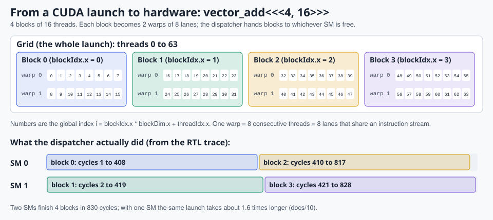
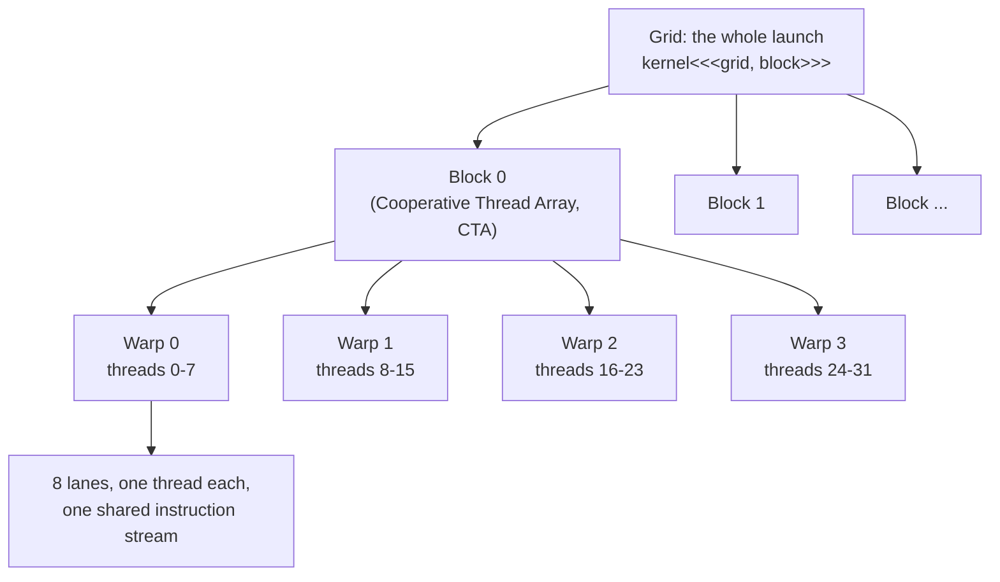

# 2. SIMT: threads, warps and blocks

> **Part 1: Concepts**, chapter 2 of 17. About 15 minutes.

**In this chapter you will learn**

- how a CUDA launch (grid, blocks, threads) maps onto warps and lanes
- which Pixelstorm instruction reads threadIdx.x, blockIdx.x and blockDim.x
- why predication (guarded instructions) often beats branching

**See it live:** [Guided tour, stop 2 (one instruction, eight threads)](https://normansrule.github.io/pixelstorm-gpu/visualizer.html?tour); [Thread hierarchy figure](img/fig-thread-hierarchy.svg)

---

## The CUDA programming model in one picture



*A real launch, `vector_add<<<4, 16>>>`, down to lanes, and which SM ran each block in the RTL trace.*



| CUDA term | Meaning | Pixelstorm |
|---|---|---|
| grid | every thread of one launch | `.grid N` blocks |
| block / CTA | threads that can share memory and barrier together; runs on one SM | `.block N` threads, at most 32 |
| warp | threads that execute in lockstep | 8 threads |
| `threadIdx.x` | position in block | `S2R Rd, TID` |
| `blockIdx.x` | which block | `S2R Rd, CTAID` |
| `blockDim.x` | threads per block | `S2R Rd, NTID` |
| `gridDim.x` | blocks in grid | `S2R Rd, NCTAID` |
| lane id | position in warp (`threadIdx.x % 32` on NVIDIA) | `S2R Rd, LANEID` |
| kernel arguments | stored in constant bank 0 | `LDC Rd, c[i]`, set with `.param i, value` |

## From CUDA C++ to Pixelstorm assembly

```cpp
__global__ void vadd(const int* A, const int* B, int* C, int n) {
    int i = blockIdx.x * blockDim.x + threadIdx.x;
    if (i >= n) return;
    C[i] = A[i] + B[i];
}
```

```asm
    S2R   R0, CTAID          ; blockIdx.x
    S2R   R1, NTID           ; blockDim.x
    S2R   R2, TID            ; threadIdx.x
    MAD   R3, R0, R1, R2     ; i
    LDC   R4, c[3]           ; n
    SETP.GE P0, R3, R4
@P0 EXIT                     ; guarded exit: only lanes with i >= n leave
    ...
    LDG   R8, [R5]
    LDG   R9, [R6]
    ADD   R10, R8, R9
    STG   [R7], R10
    EXIT
```

`nvcc` produces almost the same shape in SASS: `S2R`, `IMAD`, `ISETP`, `@P0 EXIT`, `LDG.E`, `IADD3`, `STG.E`, `EXIT`. You can check with `cuobjdump -sass` on any machine with the CUDA toolkit.

## Predication instead of branching

Every Pixelstorm instruction can carry a guard `@Pn` or `@!Pn`. A lane whose guard is false simply does nothing for that instruction. For short `if` bodies this avoids divergence entirely, which is exactly what NVIDIA's compiler does too. `04_reduction_shared` uses `@P0 LDS`, `@P0 ADD`, `@P0 STS` rather than a branch.

## How blocks reach the hardware

The block dispatcher (`rtl/ps_dispatcher.v`) hands out block 0, 1, 2 and so on, one per cycle, to whichever SM is idle. An SM holds one block at a time and splits it into warps. When all its threads have executed `EXIT` the SM tells the dispatcher it is free. Real GPUs keep several blocks resident per SM, limited by registers and shared memory; the calculation that decides how many is called *occupancy*.

In the visualizer, change `.sms` or the SM selector in "Edit and run" and watch the same kernel take roughly half the cycles with two SMs.

<!-- chapter-footer -->

## Check yourself

<details>
<summary>vector_add is launched as <<<4, 16>>> on Pixelstorm (8 lanes per warp). How many warps does each block have, and how many in total?</summary>

16 / 8 = 2 warps per block, 4 x 2 = 8 warps in total. Each SM holds one block at a time, so each SM runs 2 warps at once.

</details>

<details>
<summary>Which instruction gives a thread its blockIdx.x?</summary>

S2R Rd, CTAID. (CTA = Cooperative Thread Array, NVIDIA's formal name for a block.)

</details>

<details>
<summary>Why does "@P0 EXIT" not leave the warp stuck?</summary>

Lanes whose guard is true retire and are removed from the live set. The remaining lanes all sit at the next PC, so the warp keeps going with a smaller active mask.

</details>


---

[Previous: 1. What a GPU is](01-what-is-a-gpu.md) | [Course map](00-start-here.md) | [Next: 3. The Pixelstorm instruction set](03-isa.md)
