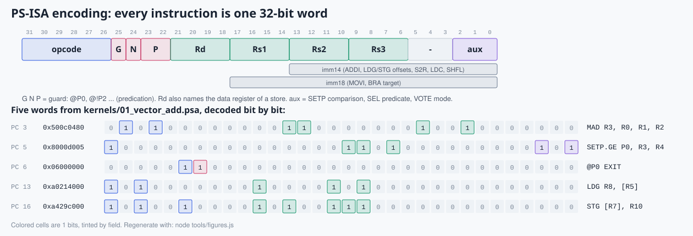

# 3. The Pixelstorm instruction set

> **Part 1: Concepts**, chapter 3 of 18. About 20 minutes.

**In this chapter you will learn**

- the 32-bit instruction format, field by field
- all 40 instructions and the CUDA, PTX or SASS operation each one imitates
- the assembler syntax used by every kernel in kernels/

**See it live:** [Instruction set tab in the visualizer](https://normansrule.github.io/pixelstorm-gpu/visualizer.html); Command line: ./pixelstorm explain LDG

---

The Pixelstorm Instruction Set Architecture (PS-ISA) has 40 instructions. Every one names the CUDA C++, PTX (Parallel Thread Execution, NVIDIA's virtual ISA) or SASS (Streaming ASSembler, the native machine code) operation it imitates.

## Encoding: one 32-bit word



*Five real instruction words from `01_vector_add`, bit by bit. Colored cells are 1 bits, tinted by field.*


```
 31      26 25 24 23 22 21   18 17   14 13   10 9     6 5   3 2   0
+----------+--+--+-----+-------+-------+-------+-------+-----+-----+
|  opcode  |G |N | P   |  Rd   |  Rs1  |  Rs2  |  Rs3  |  -  | aux |
+----------+--+--+-----+-------+-------+-------+-------+-----+-----+
                               |<------------ imm14 ------------->|   ADDI, LDG, STG ...
                       |<------------------ imm18 --------------->|   MOVI, BRA
```

| Field | Meaning |
|---|---|
| G, N, P | guard enable, guard negate, guard predicate (`@P0`, `@!P2`, ...) |
| Rd | destination register; for stores (`STG`, `STS`) the register holding the data |
| Rs1, Rs2, Rs3 | sources |
| aux | comparison for `SETP` (EQ NE LT LE GT GE LTU GEU), predicate for `SEL`, mode for `VOTE` |
| imm14 | signed 14-bit immediate or memory offset; `SHFL` packs mode in bits 13:12 and amount in 4:0 |
| imm18 | signed 18-bit immediate (`MOVI`) or absolute branch target (`BRA`) |

Registers: `R0` to `R15` per thread (32 bits). Predicates: `P0` to `P3` per thread. Special registers for `S2R`: `TID CTAID NTID NCTAID LANEID WARPID SMID CLOCK`.

## All instructions

| Mnemonic | Opcode | Group | What it does | CUDA / PTX / SASS analog |
|---|---|---|---|---|
| `NOP` | `0x00` | control | Do nothing for one instruction slot. | SASS NOP |
| `EXIT` | `0x01` | control | Guarded lanes finish; the warp retires when every lane has exited. | return from __global__; SASS EXIT; PTX exit/ret |
| `BRA` | `0x02` | control | Guarded lanes jump to the label. If only some jump, the warp diverges and reconverges by min-PC. | if/for/while; PTX bra; SASS BRA |
| `BAR` | `0x03` | control | Wait until every warp of the thread block reaches this barrier. | __syncthreads(); PTX bar.sync 0; SASS BAR.SYNC |
| `MOV` | `0x04` | data | Rd = Rs1. | PTX mov.b32; SASS MOV |
| `MOVI` | `0x05` | data | Rd = sign-extended 18-bit immediate. | PTX mov.b32 r, imm; SASS MOV32I |
| `S2R` | `0x06` | data | Rd = special register (TID, CTAID, NTID, NCTAID, LANEID, WARPID, SMID, CLOCK). | threadIdx.x / blockIdx.x ...; SASS S2R |
| `LDC` | `0x07` | data | Rd = kernel parameter c[imm] from the constant bank. | kernel arguments live in constant bank 0; SASS LDC / c[0x0][...] |
| `ADD` | `0x08` | alu | Rd = Rs1 + Rs2. | PTX add.s32; SASS IADD3 |
| `SUB` | `0x09` | alu | Rd = Rs1 - Rs2. | PTX sub.s32 |
| `MUL` | `0x0a` | alu | Rd = low 32 bits of Rs1 * Rs2. | PTX mul.lo.s32; SASS IMAD |
| `AND` | `0x0b` | alu | Rd = Rs1 & Rs2. | PTX and.b32; SASS LOP3 |
| `OR` | `0x0c` | alu | Rd = Rs1 | Rs2. | PTX or.b32; SASS LOP3 |
| `XOR` | `0x0d` | alu | Rd = Rs1 ^ Rs2. | PTX xor.b32; SASS LOP3 |
| `SHL` | `0x0e` | alu | Rd = Rs1 << Rs2[4:0]. | PTX shl.b32; SASS SHF |
| `SHR` | `0x0f` | alu | Rd = Rs1 >> Rs2[4:0] (logical). | PTX shr.u32 |
| `SRA` | `0x10` | alu | Rd = Rs1 >> Rs2[4:0] (arithmetic, keeps sign). | PTX shr.s32 |
| `MIN` | `0x11` | alu | Rd = signed minimum. | PTX min.s32; SASS IMNMX |
| `MAX` | `0x12` | alu | Rd = signed maximum. | PTX max.s32; SASS IMNMX |
| `QMUL` | `0x13` | alu | Rd = (Rs1 * Rs2) >> 16 — Q16.16 fixed-point multiply (stand-in for FMUL). | fixed-point stand-in for PTX mul.f32 / SASS FMUL |
| `MAD` | `0x14` | alu | Rd = Rs1 * Rs2 + Rs3 — the multiply-add that dominates GPU work. | PTX mad.lo.s32; SASS IMAD (float: FFMA) |
| `SEL` | `0x15` | alu | Rd = Pp ? Rs1 : Rs2 — branch-free select. | PTX selp; SASS SEL |
| `POPC` | `0x16` | alu | Rd = number of 1 bits in Rs1. | __popc(); PTX popc.b32; SASS POPC |
| `ADDI` | `0x18` | alu | Rd = Rs1 + imm14. | PTX add.s32 r, r, imm |
| `MULI` | `0x19` | alu | Rd = Rs1 * imm14. | PTX mul.lo.s32 r, r, imm |
| `ANDI` | `0x1a` | alu | Rd = Rs1 & imm14. | PTX and.b32 r, r, imm |
| `ORI` | `0x1b` | alu | Rd = Rs1 | imm14. | PTX or.b32 r, r, imm |
| `XORI` | `0x1c` | alu | Rd = Rs1 ^ imm14. | PTX xor.b32 r, r, imm |
| `SHLI` | `0x1d` | alu | Rd = Rs1 << imm. | PTX shl.b32 r, r, imm |
| `SHRI` | `0x1e` | alu | Rd = Rs1 >> imm (logical). | PTX shr.u32 r, r, imm |
| `SRAI` | `0x1f` | alu | Rd = Rs1 >> imm (arithmetic). | PTX shr.s32 r, r, imm |
| `SETP` | `0x20` | predicate | Pd = compare(Rs1, Rs2) with EQ NE LT LE GT GE LTU GEU. | PTX setp.lt.s32; SASS ISETP |
| `VOTE` | `0x21` | warp | ANY/ALL: Pd = any/all active lanes have Ps. BALLOT: Rd = bitmask of lanes with Ps. | __any_sync / __all_sync / __ballot_sync; SASS VOTE |
| `SHFL` | `0x22` | warp | Read Rs1 from another lane: IDX lane, UP by n, DOWN by n, XOR n. | __shfl_sync / __shfl_down_sync / __shfl_xor_sync; SASS SHFL |
| `LDG` | `0x28` | memory | Rd = global[Rs1 + imm]. Coalesced into cache-line transactions. | PTX ld.global; SASS LDG |
| `STG` | `0x29` | memory | global[Rs1 + imm] = Rd. | PTX st.global; SASS STG |
| `LDS` | `0x2a` | memory | Rd = shared[Rs1 + imm]. One access per bank per cycle. | __shared__ read; PTX ld.shared; SASS LDS |
| `STS` | `0x2b` | memory | shared[Rs1 + imm] = Rd. | __shared__ write; PTX st.shared; SASS STS |
| `ATOM` | `0x2c` | memory | Rd = global[Rs1]; global[Rs1] += Rs2, atomically, one lane at a time. | atomicAdd(); PTX atom.global.add; SASS ATOMG / RED |
| `ATOMS` | `0x2d` | memory | Rd = shared[Rs1]; shared[Rs1] += Rs2, atomically. | atomicAdd on __shared__; PTX atom.shared.add; SASS ATOMS |

This table is generated from the one in `web/js/pixelstorm.js`: `node tools/pixelstorm.js isa-md`.

## Assembler syntax

```asm
.kernel name          ; name used for traces and build/<name>/
.grid 4               ; blocks in the grid
.block 16             ; threads per block (1..32)
.equ N, 64            ; constant; expressions allowed: N*4+1, (A|B)<<2
.param 0, 0x200       ; kernel argument c[0]
.seq  addr, n, start, step   ; initial global memory: start, start+step, ...
.fill addr, n, value
.rand addr, n, seed, max     ; reproducible pseudo-random data
.data addr, v0, v1, ...
.dump addr, n, label  ; region shown in the CLI output and the visualizer
.lat 8                ; DRAM latency override
.sms 2                ; number of SMs override
.note text

label:
@!P1 ADD R3, R3, R2   ; optional guard, then instruction
     LDG R4, [R5+8]   ; memory operand [Rn], [Rn+imm], [Rn-imm]
```

Comments start with `;`, `//` or `#`. Mnemonics, registers and labels are case-insensitive.

## Memory model

Addresses count 32-bit **words**, not bytes, to keep the numbers readable. Global memory is 65,536 words; shared memory is 256 words per SM in 8 banks (bank = address mod 8); instruction memory holds 1,024 instructions; the constant bank holds 16 words.

<!-- chapter-footer -->

## Check yourself

<details>
<summary>Decode 0x04000000.</summary>

Bits 31 to 26 are 000001 = opcode 0x01 = EXIT. Every other field is zero, so there is no guard: EXIT.

</details>

<details>
<summary>Why does STG put its data register in the Rd field?</summary>

A store writes no register, so Rd is free. Reusing it keeps one format with three register fields plus an immediate, and keeps the decoder small.

</details>


---

[Previous: 2. SIMT: threads, warps and blocks](02-simt-warps-blocks.md) | [Course map](00-start-here.md) | [Next: 4. Microarchitecture: the block diagram](04-microarchitecture.md)
