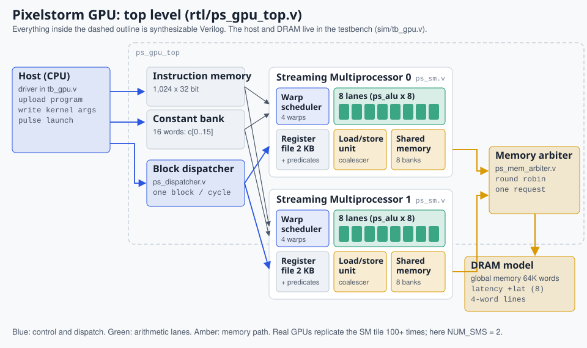
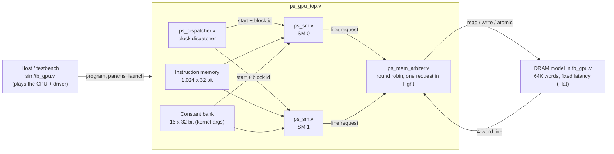
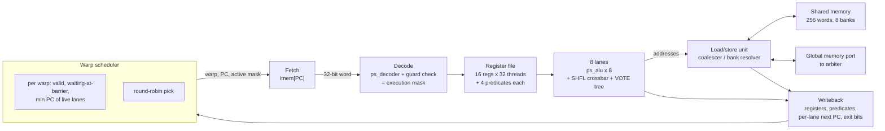
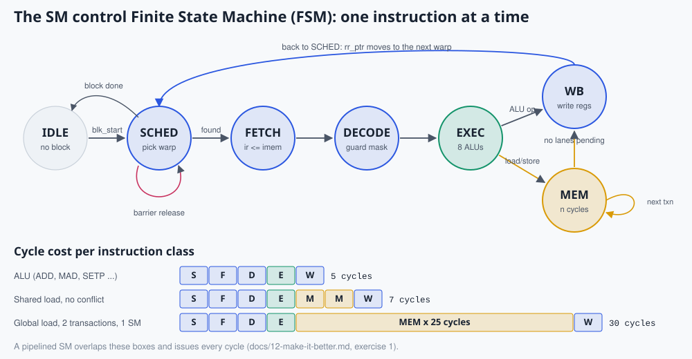
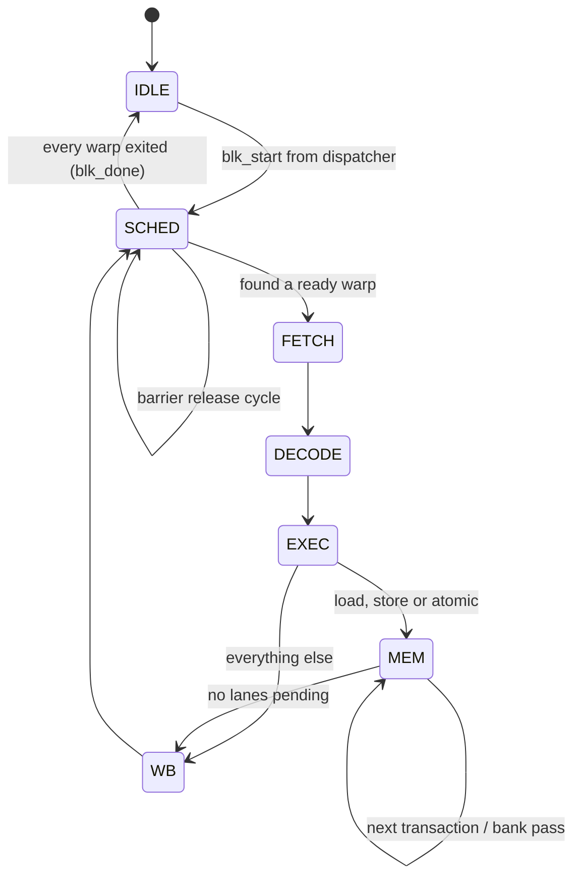

# 4. Microarchitecture: the block diagram

> **Part 2: The hardware**, chapter 4 of 17. About 20 minutes.

**In this chapter you will learn**

- what every Verilog module does and how they connect
- the state machine that moves one instruction through an SM
- the parameters you can change and re-test

**See it live:** [3D guided tour: every block, step by step](https://normansrule.github.io/pixelstorm-gpu/chip.html?tour); [Visualizer: the SM diagrams are this chapter, animated](https://normansrule.github.io/pixelstorm-gpu/visualizer.html); [Figures: top level, SM internals, FSM](img/fig-sm-internals.svg)

---

## Top level



*Top level with module names.*




| Module | Role |
|---|---|
| `rtl/ps_defines.vh` | opcodes and field constants shared by every module |
| `rtl/ps_decoder.v` | purely combinational: word to control signals |
| `rtl/ps_alu.v` | one lane's Arithmetic Logic Unit (ALU); instantiated 8 times per SM |
| `rtl/ps_sm.v` | the Streaming Multiprocessor: scheduler, register file, lanes, SHFL and VOTE units, load/store unit, shared memory, control Finite State Machine (FSM) |
| `rtl/ps_dispatcher.v` | hands thread blocks to idle SMs |
| `rtl/ps_mem_arbiter.v` | shares the single DRAM port between SMs |
| `rtl/ps_gpu_top.v` | wires it all together; host write ports for instruction and constant memory |
| `sim/tb_gpu.v` | host driver plus DRAM model with configurable latency |

All sizes are parameters: `NUM_SMS`, `NUM_WARPS`, `WARP_SIZE`, `NUM_REGS`, `LINE_WORDS`, `SMEM_WORDS`, `SMEM_BANKS`, `IMEM_AW`, `CONST_AW`.

## Inside one SM


*The same SM, labeled with the actual signal names in `rtl/ps_sm.v`, so you can search the source for any arrow.*




## The control FSM



*The FSM and what each instruction class costs in cycles.*


The SM runs one instruction at a time through these states. Each is one clock cycle except `MEM`, which lasts as long as memory needs.



So an arithmetic instruction costs 5 cycles (SCHED, FETCH, DECODE, EXEC, WB) and a memory instruction costs 6 plus its memory time. This is intentionally slow: a pipelined design overlaps these stages and issues one instruction per cycle ([12-make-it-better.md](12-make-it-better.md), exercise 1).

## Per-thread state

| State | Size per SM (defaults) | Where |
|---|---|
| General registers `rf` | 32 threads x 16 x 32 bit = 2 KB | `ps_sm.v` |
| Predicates `preds` | 32 threads x 4 bits | `ps_sm.v` |
| Per-thread PC `lpc` | 32 x 10 bits | `ps_sm.v` |
| Exited flag `ldone` | 32 bits | `ps_sm.v` |
| Warp flags `w_valid`, `w_wait` | 4 + 4 bits | `ps_sm.v` |

An NVIDIA SM has a 256 KB register file. The ratio of register file to arithmetic units is a real design trade-off: more registers means more resident warps to hide memory latency.

## Parameters worth changing

Rebuild with different values and rerun `make test` to see whether the design still holds together:

```bash
iverilog -g2012 -I rtl -Ptb_gpu.NUM_SMS=4 -o build/tb4.vvp sim/tb_gpu.v rtl/*.v
node tools/pixelstorm.js test --sms 4     # compiles and checks for you
node tools/pixelstorm.js rtl kernels/07_matmul.psa --lat 40    # slower DRAM
```

<!-- chapter-footer -->

## Check yourself

<details>
<summary>How many cycles does an ADD take? A shared-memory load with a 2-way bank conflict?</summary>

ADD: 5 (SCHED, FETCH, DECODE, EXEC, WB). The shared load: 4 cycles to reach MEM, 2 bank passes plus 1 cycle to finish MEM, then WB = 8 cycles.

</details>

<details>
<summary>What stops both SMs from loading global memory at the same time?</summary>

There is one memory arbiter with one outstanding request. The second SM waits until the first request returns. Real GPUs have many memory channels and many requests in flight.

</details>


---

[Previous: 3. The Pixelstorm instruction set](03-isa.md) | [Course map](00-start-here.md) | [Next: 5. Life of one instruction](05-instruction-lifecycle.md)
