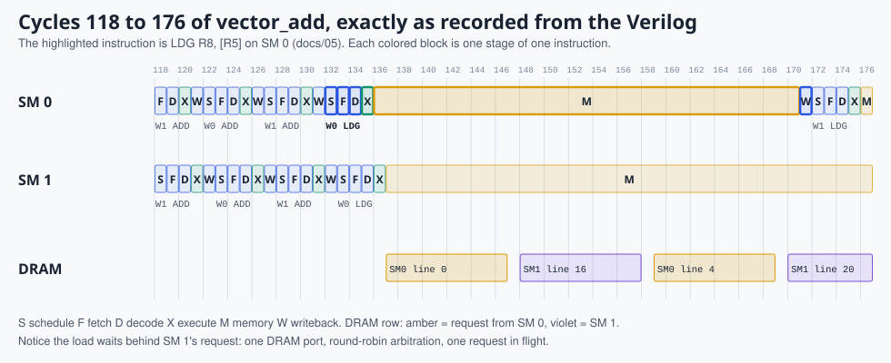

# 5. Life of one instruction

> **Part 2: The hardware**, chapter 5 of 16. About 15 minutes.

**In this chapter you will learn**

- one real LDG followed through every clock cycle of the RTL simulation
- where its 40 cycles actually go
- how to find the same moment in GTKWave

**See it live:** [Guided tour, stop 3 (coalescing and DRAM latency)](https://normansrule.github.io/pixelstorm-gpu/visualizer.html?tour); Waveform: make wave

---

This page follows one real instruction from the RTL trace of `01_vector_add`: the load `LDG R8, [R5]` at PC 13, executed by warp 0 of block 0 on SM 0. Every number below comes from `web/traces/vector_add.json`, which is printed by the Verilog itself (`$display` in `ps_sm.v`).




*Cycles 118 to 176 of the RTL run. The outlined blocks are the `LDG` described below; the DRAM row shows both SMs taking turns at the single memory port.*

| Cycle | State | What the hardware does |
|---|---|---|
| 132 | SCHED | Round-robin pointer reaches warp 0. All 8 lanes have PC 13, so the active mask is `11111111`. |
| 133 | FETCH | `ir <= imem[13]` = `0xa0214000`. |
| 134 | DECODE | `ps_decoder` sees opcode `0x28` = `LDG`, `Rd = 8`, `Rs1 = 5`, `imm14 = 0`. No guard, so the execution mask equals the active mask. |
| 135 | EXEC | Each lane reads its own `R5` (the address of `A[i]`) and adds the offset: addresses 0 to 7. |
| 136 | MEM | The load/store unit takes the lowest pending lane (lane 0), computes its 4-word line (address 0), and marks lanes 0 to 3 as served by that line. It raises `mreq_valid`. |
| 137 | MEM | The arbiter grants SM 0 and sends a read of line 0 to DRAM. |
| 138 to 147 | MEM | The DRAM model counts down its 8-cycle latency. Meanwhile SM 1 also wants memory and queues behind us. |
| 148 | MEM | Arbiter, now free, grants SM 1 (round robin). |
| 159 | MEM | SM 0 gets the port again for its second line (addresses 4 to 7). |
| 170 | MEM | Second line returns; no lanes pending. |
| 171 | WB | `R8` of all 8 lanes is written with `0, 1, ..., 7`; every lane's PC becomes 14. |

Total: 40 cycles for one warp-wide load, 35 of them in memory, and about half of those waiting for the other SM. That single observation motivates three of the biggest ideas in GPU design:

1. **Latency hiding:** let other warps run while this one waits (multithreading).
2. **Caches:** the second line was probably fetched moments before by another warp.
3. **Memory-level parallelism:** allow more than one outstanding request.

## See it yourself

In the visualizer pick `01 vector add`, press **Next instruction** until the instruction strip shows `LDG R8, [R5]`, then step cycle by cycle with the right arrow key. The lanes turn amber and read "serving #1", "queued #2"; the arbiter and DRAM boxes light up; the DRAM progress bar fills over 8 cycles.

In GTKWave:

```bash
node tools/pixelstorm.js rtl kernels/01_vector_add.psa --vcd
gtkwave build/vector_add/wave.vcd sim/wave.gtkw
```

Use the `cycle` signal at the top to find cycle 132 (the counter restarts at kernel launch, after the program upload). Watch `state` step 1, 2, 3, 4 (SCHED, FETCH, DECODE, EXEC), then sit at 5 (MEM) while `lpend` goes from `ff` to `f0` to `00`, and finally 6 (WB).

## An arithmetic instruction for comparison

`ADD R5, R5, R3` at PC 10 of the same warp: SCHED 102, FETCH 103, DECODE 104, EXEC 105, WB 106. Five cycles, all 8 ALUs busy in cycle 105.

<!-- chapter-footer -->

## Check yourself

<details>
<summary>DRAM latency is 8 cycles, yet the LDG spent 35 cycles in MEM. Where did the rest go?</summary>

Two transactions of roughly 10 to 11 cycles each (arbiter grant, 8 cycles of DRAM, response), plus waiting while the other SM's requests used the single memory port.

</details>

<details>
<summary>Which signal in ps_sm.v tells you the MEM stage is finished?</summary>

lpend, the mask of lanes still waiting for memory. When it reaches 0 the FSM moves to WB.

</details>


---

[Previous: 4. Microarchitecture: the block diagram](04-microarchitecture.md) | [Course map](00-start-here.md) | [Next: 6. Reading the RTL](06-reading-the-rtl.md)
