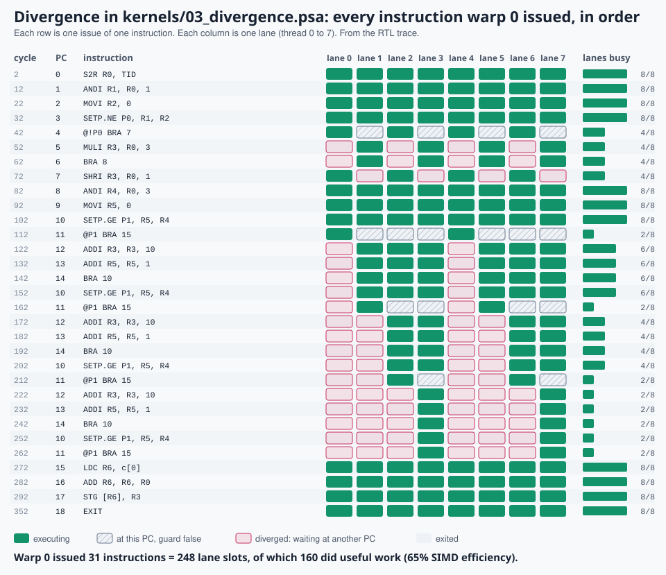
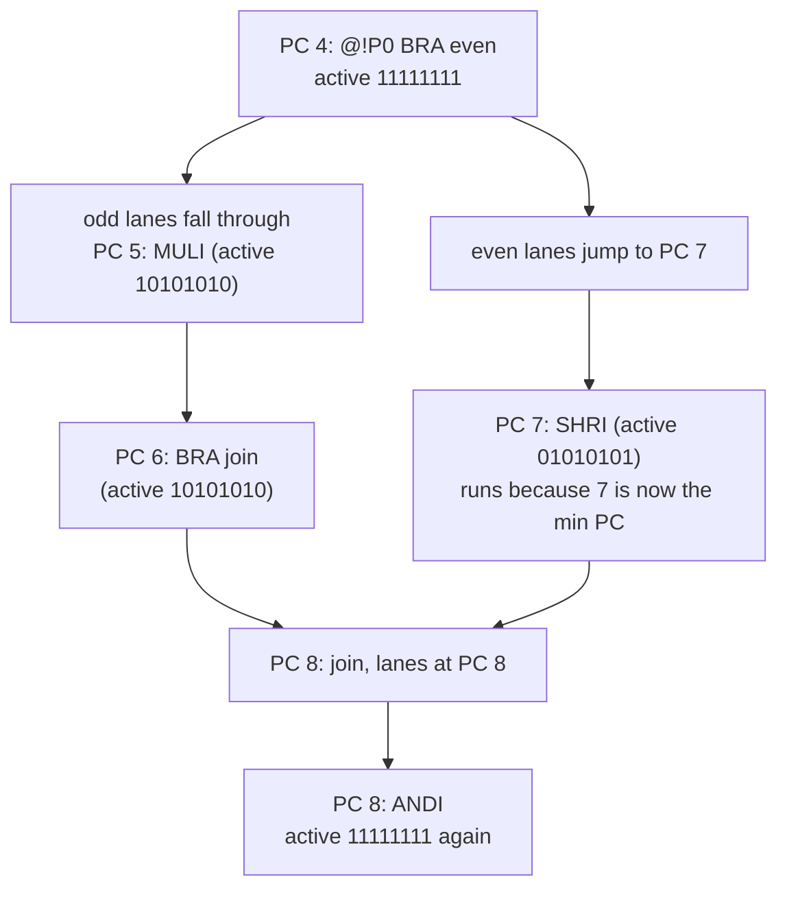

# 7. Divergence and reconvergence

> **Part 3: Performance**, chapter 7 of 18. About 20 minutes.

**In this chapter you will learn**

- what happens when the lanes of one warp take different branches
- how min-PC scheduling reconverges them, and how NVIDIA hardware does it
- how to measure the cost (SIMD efficiency) and when to use predication instead

**See it live:** [Guided tour, stops 4 and 5](https://normansrule.github.io/pixelstorm-gpu/visualizer.html?tour); [Divergence lab](https://normansrule.github.io/pixelstorm-gpu/labs.html#diverge)

---

A warp has one instruction stream but 8 threads. What happens when the threads disagree about a branch?

## What Pixelstorm does: per-thread PCs and min-PC scheduling

*Every instruction warp 0 issued in `03_divergence`, straight from the RTL trace. Magenta cells are lanes parked at a different PC.*

Every thread keeps its own program counter (`lpc` in `ps_sm.v`). Each time the scheduler picks a warp it:

1. finds the **minimum PC** among the warp's live (not exited) lanes;
2. makes every lane whose PC equals that minimum **active**;
3. runs the instruction for the active lanes only.

Lanes that jumped ahead simply wait. Lanes that are behind catch up. When their PCs become equal again they are automatically reconverged, with no special instruction.

That is `kernels/03_divergence.psa`. Its whole-kernel SIMD (Single Instruction, Multiple Data) efficiency is about 65%: a third of all lane slots did nothing.

Why is min-PC a good rule? For structured code (if/else, loops) produced by a compiler, the join point of a branch has a higher PC than both sides, so running the lowest PC first finishes the "behind" path and meets the other path at the join. This is the scheme analyzed by Collange (2011) and in the thread-frontier work of Diamos et al. (MICRO 2011).

## What real GPUs do

| Approach | Used by | Mechanism | Trade-off |
|---|---|---|---|
| SIMT reconvergence stack | NVIDIA before Volta (Tesla to Pascal), AMD uses a similar scheme in software via exec masks | The compiler inserts a "set sync point" (`SSY`) before a divergent branch; hardware pushes the other path and the reconvergence PC onto a stack; `SYNC` pops | Cheap and deterministic, but threads of one warp cannot wait on each other (a spin lock between lanes deadlocks) |
| Per-thread PC with a convergence optimizer | NVIDIA Volta and later ("Independent Thread Scheduling") | Each thread has a PC and call stack; the scheduler picks a subset to run; `BSSY`/`BSYNC` and `__syncwarp()` mark where to reconverge | Allows starvation-free locks between lanes; programmer must use `*_sync` intrinsics with a mask |
| Min-PC (thread frontiers) | Pixelstorm, research designs | Always run the lowest PC | No compiler help needed for structured code; can reconverge late with unstructured `goto`-style control flow |
| Dynamic warp formation | Research (Fung et al., MICRO 2007) | Regroup threads from different warps that are at the same PC into new, fuller warps | Higher SIMD efficiency, but complex register file banking |

## Loops with different trip counts

In the second half of `03_divergence`, lane `i` loops `i & 3` times. Watch the active mask shrink as lanes leave: `11111111`, then `11101110`, then `11001100`, then `10001000`. Each loop iteration costs a full instruction slot even when only 2 of 8 lanes do work.

## Try it

1. Open the visualizer, pick `03 divergence`, and press **Next instruction** repeatedly. Diverged lanes are drawn with a dashed magenta border and say "waits PC 7". In the warp scheduler the dots show which lanes are at the minimum PC (green) and which are elsewhere (magenta).
2. In "Edit and run", replace the branch with predication: `@P0 MULI R3, R0, 3` and `@!P0 SHRI R3, R0, 1`. Both run for every lane but no branch, no divergence. Compare cycles.
3. Research question: what happens with min-PC scheduling if the "else" block were placed *before* the "if" block in memory? (Hint: it still works, but the order of execution changes. Can you build code where min-PC reconverges later than a stack would?)

<!-- chapter-footer -->

## Check yourself

Lanes 0 to 3 branch to PC 20; lanes 4 to 7 fall through to PC 5. Which lanes run next?

Lanes 4 to 7, because PC 5 is the minimum PC. Lanes 0 to 3 wait until the others reach PC 20 or beyond.

When is predication cheaper than a branch?

When both sides are short. Predication issues both sides for every lane but saves the branch instructions; a branch only wins when the lanes agree (a uniform branch) or the bodies are long.

---

[Previous: 6. Reading the RTL](06-reading-the-rtl.md) | [Course map](00-start-here.md) | [Next: 8. Memory: coalescing and banks](08-memory.md)
