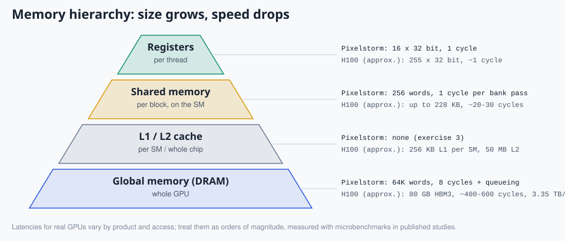
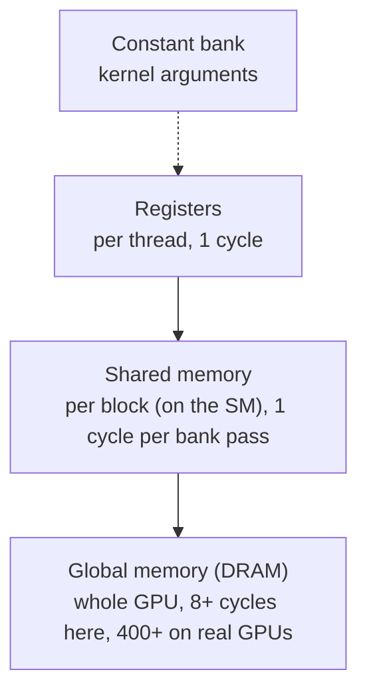
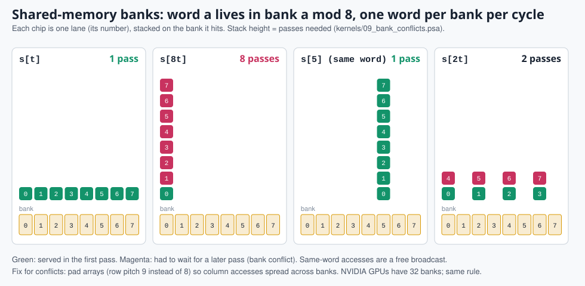

# 8. Memory: coalescing and banks

> **Part 3: Performance**, chapter 8 of 17. About 25 minutes.

**In this chapter you will learn**

- the memory hierarchy, from registers to DRAM
- how the load/store unit coalesces lanes into line-sized transactions
- why shared memory has banks and how padding removes conflicts

**See it live:** [Coalescing lab](https://normansrule.github.io/pixelstorm-gpu/labs.html#coalesce); [Bank conflict lab](https://normansrule.github.io/pixelstorm-gpu/labs.html#banks); [Guided tour, stop 6](https://normansrule.github.io/pixelstorm-gpu/visualizer.html?tour)

---

## The memory hierarchy

*Pixelstorm sizes next to approximate H100 figures.*

Real GPUs add L1 and L2 caches between the SM and DRAM. Pixelstorm leaves them out so every global access is visible; adding one is exercise 3 in [12-make-it-better.md](12-make-it-better.md).

## Coalescing

*The three loads of `08_coalescing`. Lane color = which transaction serves it. Try other strides in the coalescing lab (`web/labs.html#coalesce`).*

DRAM delivers whole lines (4 words here, 32 bytes or 128 bytes on NVIDIA). The load/store unit in `ps_sm.v`:

1. picks the lowest-numbered lane that still needs memory (the *leader*);
2. computes the leader's line address `addr & ~(LINE_WORDS-1)`;
3. serves **every** pending lane whose address falls in that same line with one transaction;
4. repeats until no lane is pending.

`kernels/08_coalescing.psa` loads the same amount of data three ways:

| Access pattern | Lanes per line | Transactions | Memory cycles (1 SM, latency 8) |
|---|---|---|---|
| `in[i]` contiguous | 4 | 2 | 25 |
| `in[i*4]` stride 4 | 1 | 8 | 97 |
| `in[0]` everyone the same | 8 | 1 | 13 |

This is why CUDA programmers prefer a *structure of arrays* (`x[i]`, `y[i]` in separate arrays) over an *array of structures* (`p[i].x`, `p[i].y`): consecutive threads then touch consecutive words.

## Shared memory banks

*The four accesses of `09_bank_conflicts`. Stack height is the number of cycles. The bank lab lets you try padding.*

Shared memory is split into 8 banks; word `a` lives in bank `a mod 8`. Each bank can deliver one word per cycle, so a warp's access finishes in one cycle only if all lanes use different banks, or the same word (a broadcast).

`kernels/09_bank_conflicts.psa`:

| Access | Banks hit | Passes |
|---|---|---|
| `s[t]` | all 8 different | 1 |
| `s[8t]` | all bank 0, different words | 8 (8-way conflict) |
| `s[5]` | one word | 1 (broadcast) |
| `s[2t]` | banks 0, 2, 4, 6, each twice | 2 |

The classic fix is padding: store a 2D tile as `s[row*9 + col]` instead of `s[row*8 + col]` so column accesses spread across banks. NVIDIA has 32 banks and the same rule.

## Atomics

`ATOM.ADD` (global) and `ATOMS.ADD` (shared) do read-modify-write in one step so two lanes cannot both read the old value. Pixelstorm serializes atomics one lane at a time; `06_histogram` shows the cost. Real GPUs perform atomics in the L2 cache slices and combine lanes that hit the same address.

## Try it

- In the visualizer the load/store unit box says "2 transactions" and each lane shows "serving #1" or "queued #2". For shared memory the bank row lights up and conflicting banks turn magenta.
- Run `node tools/pixelstorm.js rtl kernels/08_coalescing.psa --lat 100` and compare the three loads.

<!-- chapter-footer -->

## Check yourself

8 lanes load in[2*i] with 4-word lines. How many transactions?

Addresses 0, 2, 4, ..., 14 touch lines 0, 4, 8 and 12: 4 transactions, and half of every fetched line is wasted.

8 lanes access s[4*t] with 8 banks. How many passes?

Addresses 0, 4, 8, ..., 28 fall in banks 0, 4, 0, 4, ...: bank 0 gets 4 different words, so 4 passes (a 4-way conflict).

---

[Previous: 7. Divergence and reconvergence](07-divergence.md) | [Course map](00-start-here.md) | [Next: 9. Synchronization: barriers, shuffles, votes, atomics](09-synchronization.md)
