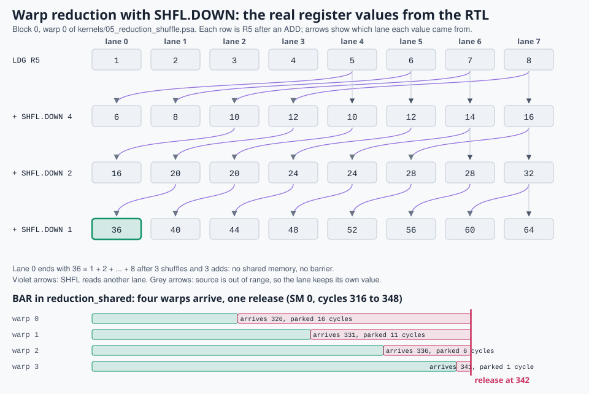

# 9. Synchronization: barriers, shuffles, votes, atomics

> **Part 3: Performance**, chapter 9 of 16. About 20 minutes.

**In this chapter you will learn**

- how threads cooperate at warp, block and grid scope
- how BAR is implemented in hardware and why misuse is dangerous
- three ways to write a reduction, and when each wins

**See it live:** [Guided tour, stops 7 to 9](https://normansrule.github.io/pixelstorm-gpu/visualizer.html?tour)

---

Threads cooperate in three scopes, each with its own tools.

| Scope | Tool | Pixelstorm | CUDA |
|---|---|---|---|
| Warp (8 lanes) | exchange registers | `SHFL.IDX/UP/DOWN/XOR` | `__shfl_sync`, `__shfl_up_sync`, `__shfl_down_sync`, `__shfl_xor_sync` |
| Warp | collective decision | `VOTE.ANY/ALL/BALLOT` | `__any_sync`, `__all_sync`, `__ballot_sync` |
| Block (up to 4 warps) | wait for everyone | `BAR` | `__syncthreads()` |
| Block | shared scratchpad | `LDS`, `STS`, `ATOMS` | `__shared__` |
| Grid | atomic read-modify-write | `ATOM.ADD` | `atomicAdd` |

## The barrier in hardware

`BAR` sets the warp's `w_wait` bit at writeback. The scheduler skips waiting warps. When every live warp of the block is waiting (`bar_release` in `ps_sm.v`) all bits clear in one cycle. The trace records that cycle as a `bar` event and the visualizer's timeline draws a magenta line.

```verilog
wire bar_release = (|(live & w_wait)) && ((live & ~w_wait) == 0);
```

On NVIDIA hardware a `__syncthreads()` that only some threads of a block reach is undefined behavior and often hangs. Pixelstorm's barrier is simpler: it counts *warps*, not threads, treats every `BAR` as the same barrier, and ignores exited warps. A skipped barrier therefore mismatches silently instead of hanging. Exercise: give `BAR` an ID and an expected thread count, the way PTX `bar.sync a, b` does, and make the RTL report a mismatch.

## Shuffle: a crossbar between lanes



*Top: the actual R5 values of block 0, warp 0 after each step of the shuffle reduction. Bottom: four warps reaching a `BAR` at different times and all leaving together.*

`SHFL.DOWN R6, R5, 4` gives lane `l` the value of `R5` from lane `l+4`. In hardware (`shfl_y` in `ps_sm.v`) this is an 8-to-8 multiplexer network reading the register file of all lanes in the same cycle. `05_reduction_shuffle` sums 8 values in 3 steps (4, 2, 1) with no memory at all, and `11_prefix_scan` builds an inclusive scan with `SHFL.UP`.

## Vote: a reduction tree over predicates

`VOTE.BALLOT R4, P0` gives every lane an 8-bit mask of which lanes had `P0` true; `POPC` counts them. `VOTE.ANY` and `VOTE.ALL` are an OR-tree and an AND-tree. `10_vote_ballot` uses all three.

## Reduction three ways

| Kernel | Mechanism | Why pick it |
|---|---|---|
| `04_reduction_shared` | shared memory tree + `BAR` each level | works across warps |
| `05_reduction_shuffle` | shuffles inside a warp, one `ATOM.ADD` per warp | no barrier, no shared memory |
| (exercise) | shuffle inside warps, then shared memory across warps | what production libraries such as CUB do |

<!-- chapter-footer -->

## Check yourself

<details>
<summary>Why does reduction_shuffle need no BAR?</summary>

All communication stays inside one warp and goes through registers (SHFL). The lanes of a warp execute in lockstep, so each shuffle sees the previous step's results.

</details>

<details>
<summary>What goes wrong if two lanes update the same histogram bin with LDG, ADD, STG instead of ATOM?</summary>

Both read the old count, both add one, both store: one increment is lost. ATOM does the read-modify-write as one indivisible step.

</details>


---

[Previous: 8. Memory: coalescing and banks](08-memory.md) | [Course map](00-start-here.md) | [Next: 10. Applications: the 15 kernels](10-applications.md)
