# 10. Applications: the 16 kernels

> **Part 4: Applications and graphics**, chapter 10 of 18. About 20 minutes.

**In this chapter you will learn**

- what each example kernel does and which hardware feature it exposes
- how each kernel looks on the hardware (timelines from the RTL)
- how to write, test and visualize your own kernel

**See it live:** [Visualizer: pick any kernel](https://normansrule.github.io/pixelstorm-gpu/visualizer.html); Command line: ./pixelstorm list

---

The three graphics kernels (13 to 15) get their own chapter, [11. Graphics](11-graphics.md). Each kernel in `kernels/` opens with the CUDA C++ it corresponds to and a "watch for" note. Cycle counts are from the RTL (`make test`), DRAM latency 8.

| # | Kernel | Real-world use | Hardware feature it shows | Cycles, 1 SM | Cycles, 2 SMs | SIMD efficiency |
|---|---|---|---|---|---|---|
| 01 | `vector_add` | "hello world" of CUDA; element-wise tensor ops | SIMT, guarded `EXIT`, coalesced loads | 1,333 | 830 | 94% |
| 02 | `saxpy_fixed` | BLAS level 1, `y = a*x + y` | Q16.16 fixed-point multiply (`QMUL`) as a stand-in for `FFMA` | 1,327 | 835 | 94% |
| 03 | `divergence` | any `if` and data-dependent loop | per-thread PC, min-PC reconvergence | 364 | 364 | 65% |
| 04 | `reduction_shared` | sum, max, dot product, softmax denominators | shared memory, `BAR`, predication | 5,981 | 3,106 | 72% |
| 05 | `reduction_shuffle` | warp-level reductions in cuBLAS, CUB | `SHFL.DOWN`, `ATOM.ADD` | 2,221 | 1,250 | 86% |
| 06 | `histogram` | image processing, analytics, radix sort | global atomics, serialization | 2,925 | 2,162 | 100% |
| 07 | `matmul` | neural networks, graphics transforms | `MAD` inner loop, broadcast plus coalesced loads | 5,919 | 3,567 | 99% |
| 08 | `coalescing` | data-layout decisions (AoS vs SoA) | 2 vs 8 vs 1 transactions | 284 | 284 | 100% |
| 09 | `bank_conflicts` | tiled algorithms, transposes | 1, 8, broadcast, 2-way bank passes | 228 | 228 | 100% |
| 10 | `vote_ballot` | stream compaction, early exit | `VOTE.BALLOT/ANY/ALL`, `POPC`, `SEL` | 832 | 832 | 69% |
| 11 | `prefix_scan` | compaction, sorting, sparse matrices | Hillis-Steele scan with `SHFL.UP` | 687 | 403 | 96% |
| 12 | `threshold_image` | pixel shaders, image filters | branch-free `SEL`, zero divergence | 1,047 | 639 | 100% |
| 13 | `gradient_shader` | the simplest pixel shader | one thread per pixel, `.fb` framebuffer, coalesced stores | 16,097 | 8,892 | 100% |
| 14 | `triangle_raster` | drawing every 3D triangle | edge functions, barycentric color, predication instead of branches | 32,737 | 17,212 | 99% |
| 15 | `mandelbrot` | fractals, data-dependent shaders | Q16.16 loop with per-lane exit: heavy divergence, min-PC reconvergence | 46,729 | 23,420 | 73% |
| 16 | `matmul_cached` | the same matrix multiply on a GPU with a cache | `.cache 16`: a shared direct-mapped cache, 80% hit rate | | 2,687 | 99% |

Kernels with a single block (03, 08, 09, 10) cannot use a second SM, so the cycle count is identical: parallel hardware only helps when there is parallel work. That is Amdahl's law in miniature.


## What each kernel looks like on the hardware

Every bar is one warp instruction from schedule to writeback, recorded from the Verilog. Look for the patterns: amber memory bars dominating `vector_add`, the regular barrier lines (magenta) in `reduction_shared`, serialized atomics in `histogram`, and the tight loop of `matmul`.

### 01 vector add

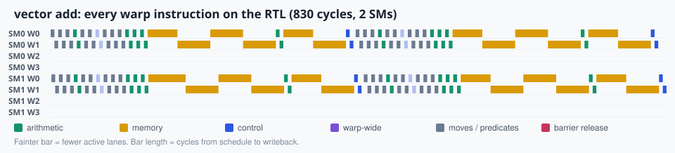

### 02 saxpy fixed

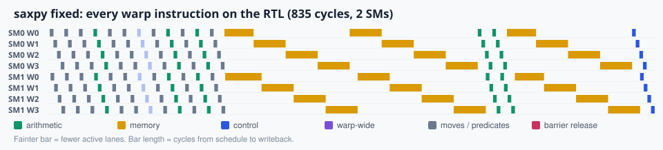

### 03 divergence

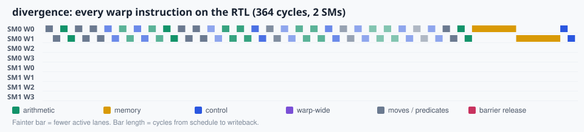

### 04 reduction shared

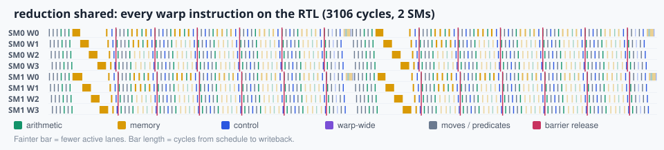

### 05 reduction shuffle

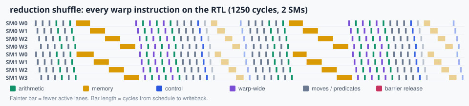

### 06 histogram

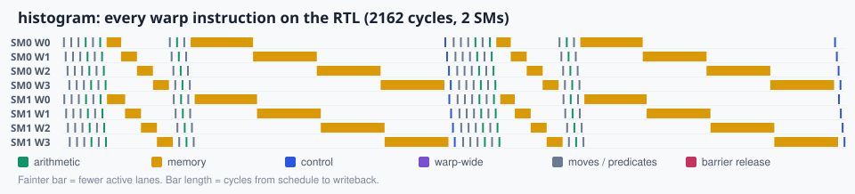

### 07 matmul

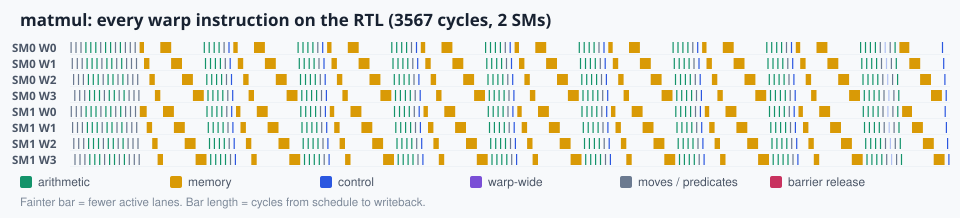

### 08 coalescing

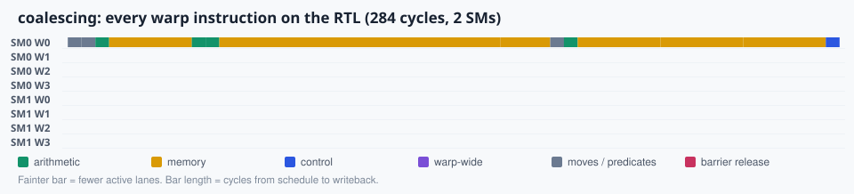

### 09 bank conflicts

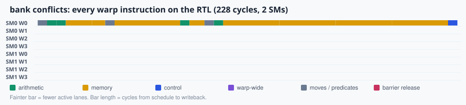

### 10 vote ballot

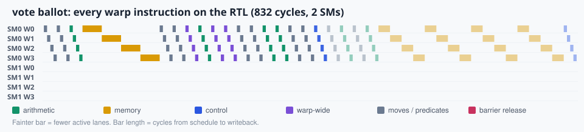

### 11 prefix scan

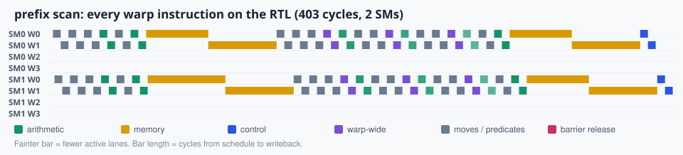

### 12 threshold image

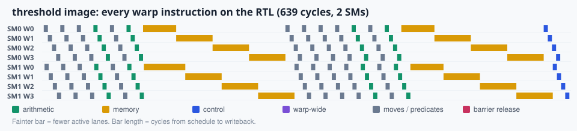

### 13 gradient shader

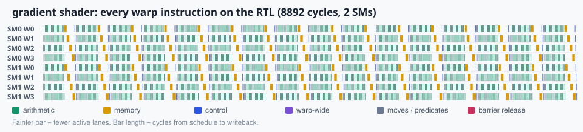

### 14 triangle raster

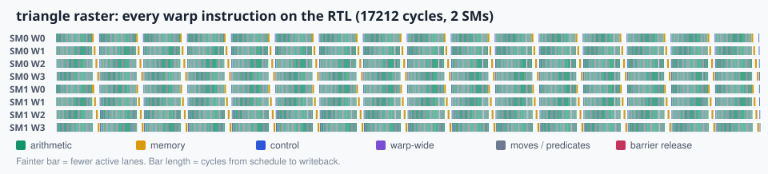

### 15 mandelbrot

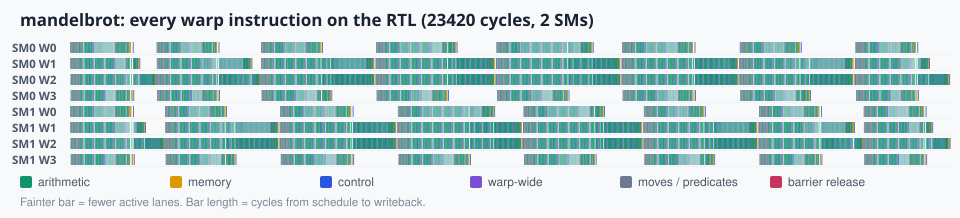

### 16 matmul cached

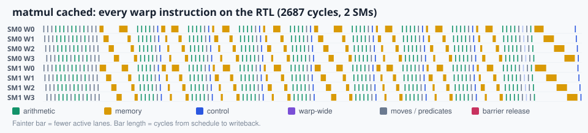

## Writing your own

```asm
.kernel square
.grid 2
.block 32
.equ IN, 0x000
.equ OUT, 0x100
.param 0, IN
.param 1, OUT
.seq IN, 64, 0, 1
.dump OUT, 64, out[i] = in[i]^2

    S2R  R0, CTAID
    S2R  R1, NTID
    S2R  R2, TID
    MAD  R3, R0, R1, R2
    LDC  R4, c[0]
    ADD  R4, R4, R3
    LDG  R5, [R4]
    MUL  R6, R5, R5
    LDC  R7, c[1]
    ADD  R7, R7, R3
    STG  [R7], R6
    EXIT
```

Save it as `kernels/16_square.psa` (or let `./pixelstorm new square` create it), then:

```bash
node tools/pixelstorm.js sim kernels/13_square.psa      # instant check
node tools/pixelstorm.js rtl kernels/13_square.psa      # on the Verilog
make traces bundle                              # add it to the visualizer
```

Add an answer check to `tests/expected.js` (a function named after `.kernel`) and `make test` will verify it forever after.

<!-- chapter-footer -->

## Check yourself

<details>
<summary>Why is divergence exactly as fast on 2 SMs as on 1?</summary>

It launches a single block, and a block runs on one SM. The second SM has nothing to do.

</details>

<details>
<summary>What are the steps to add your own kernel?</summary>

./pixelstorm new <name>, edit it, ./pixelstorm sim <name>, ./pixelstorm rtl <name>, add an answer check to tests/expected.js, then make traces to see it in the visualizer.

</details>


---

[Previous: 9. Synchronization: barriers, shuffles, votes, atomics](09-synchronization.md) | [Course map](00-start-here.md) | [Next: 11. Graphics: pixels, triangles and fractals](11-graphics.md)
