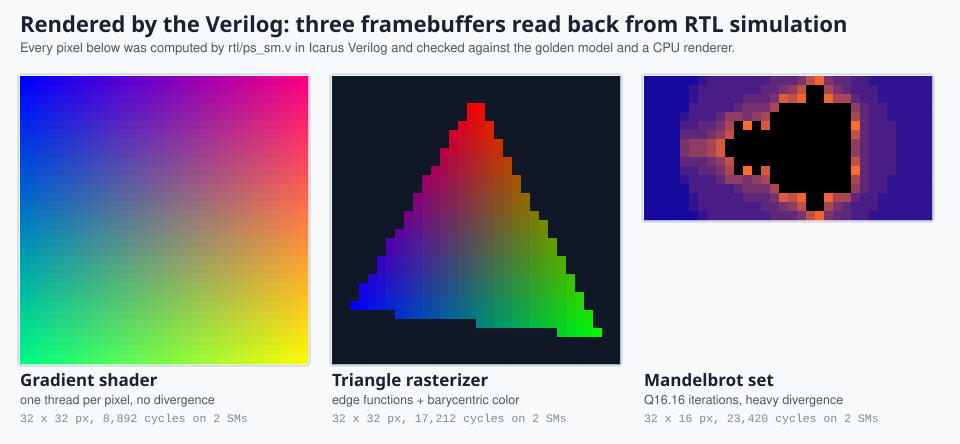
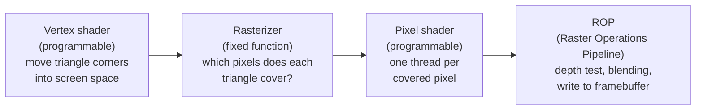
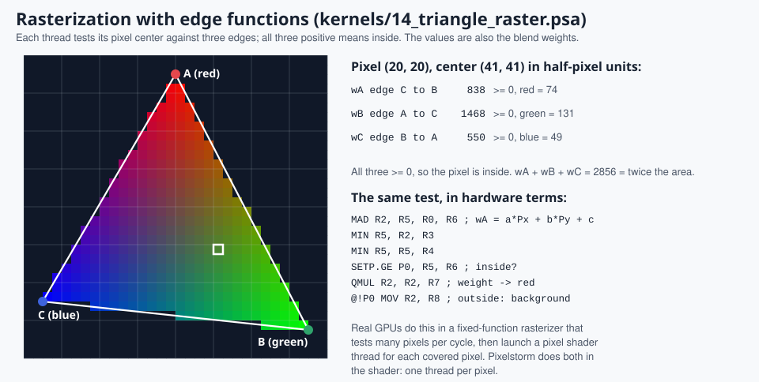
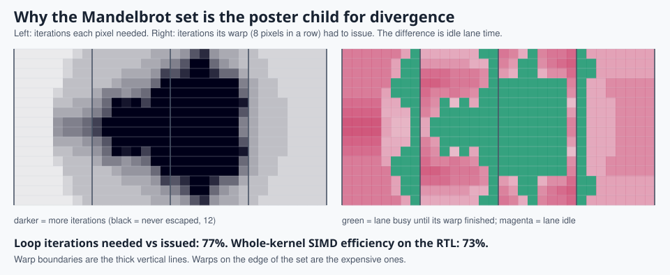

# 11. Graphics: pixels, triangles and fractals

> **Part 4: Applications and graphics**, chapter 11 of 18. About 30 minutes.

**In this chapter you will learn**

- why "one thread per pixel" is the reason GPUs exist
- how a triangle is rasterized with three edge functions and colored with barycentric weights
- why fractals and other data-dependent shaders diverge, and how warp shape changes the cost

**See it live:** [Guided tour, stops 10 and 11](https://normansrule.github.io/pixelstorm-gpu/visualizer.html?tour); [Pixels and warps lab](https://normansrule.github.io/pixelstorm-gpu/labs.html#pixels); [Visualizer: 15 mandelbrot, framebuffer panel](https://normansrule.github.io/pixelstorm-gpu/visualizer.html)

---



## Why GPUs exist: one thread per pixel

A 4K display has about 8.3 million pixels, redrawn 60 or more times a second. Each pixel's color is computed by the same small program, a **pixel shader** (also called a fragment shader), with different inputs. That is the perfect SIMT (Single Instruction, Multiple Threads) workload: launch one thread per pixel, group neighbouring pixels into warps, and run them in lockstep. General-purpose GPU computing (CUDA) grew out of exactly this hardware.

A real graphics pipeline has more stages. Some are fixed-function hardware, some are programmable shaders that run on the same SMs (Streaming Multiprocessors) as CUDA kernels:



Pixelstorm has no fixed-function units, so its graphics kernels do the rasterizer's job in the shader too. That makes every step visible, which is the point.

## The framebuffer

A framebuffer is just an image stored in memory. In Pixelstorm it is a region of global memory holding one 32-bit word per pixel, laid out row by row, with the color packed as `0x00RRGGBB`. A kernel declares it with one directive:

```asm
.fb FB, 32, 32        ; address, width, height
```

The visualizer then shows that memory as an image at the top of the right-hand panel. Unwritten pixels are a checkerboard, freshly stored ones get a white outline, and hovering a pixel shows its address, color and the cycle it was written. Watching `13 gradient shader` fill in block by block is the clearest possible picture of a grid launch.

## 13 gradient_shader: hello, shader

Each thread computes its pixel's color from its coordinates: `x` from `threadIdx.x`, `y` from `blockIdx.x`. There are no branches and every store is coalesced, so SIMD (Single Instruction, Multiple Data) efficiency is 100%. On two SMs the 1,024 pixels take 8,892 cycles, almost exactly half of the 16,097 on one SM: pixel work scales with the hardware.

## 14 triangle_raster: how a GPU draws a triangle



For an edge from `V0` to `V1`, the **edge function** of a point `P` is

```
E(P) = (V1y - V0y) * Px  -  (V1x - V0x) * Py  +  (V0y * (V1x - V0x) - V0x * (V1y - V0y))
```

It is zero on the edge's line, positive on one side and negative on the other. A pixel center is inside the triangle when all three edge functions are non-negative. This formulation (Pineda, 1988) is what real rasterizers use, because it is just multiplies and adds, perfectly parallel, with no division.

The same three numbers do a second job. Divided by the triangle's area, they are the **barycentric weights** of the pixel: how much of each corner's color, texture coordinate or depth to blend. The kernel multiplies each weight by a precomputed `255 / area` in Q16.16 fixed point (one `QMUL`) to get red, green and blue.

Three details worth noticing in `kernels/14_triangle_raster.psa`:

- **Half-pixel units.** Coordinates are doubled so pixel centers `(x + 0.5, y + 0.5)` become the integers `(2x + 1, 2y + 1)`.
- **The driver's job.** The assembler computes the edge coefficients with `.equ` and passes them as kernel arguments (`.param`), exactly what a graphics driver does when it sets up a triangle.
- **No divergence.** Inside or outside is decided with a predicate, `@!P0 MOV R2, R8`, not a branch. Warps that straddle an edge never split, and SIMD efficiency stays at 99%.

## 15 mandelbrot: a storm of pixels, and divergence

The Mandelbrot set is the classic "graphically intense" GPU demo. For each pixel `c`, iterate `z = z*z + c` starting from zero and count the steps until `|z| > 2`. The count becomes the color; points that never escape (here, within 12 iterations) are black.

Every lane needs a different number of iterations, and a warp keeps issuing the loop until its slowest lane is finished:



On the edge of the set, neighbouring pixels differ wildly, so their warps are mostly idle lanes. In the visualizer, pick `15 mandelbrot` and step through the loop: lanes that have escaped wait at `done:` (dashed magenta) while the rest keep iterating, and min-PC scheduling reconverges them when the last lane arrives.

Two ways real GPUs reduce this cost, both explorable in the [Pixels and warps lab](https://normansrule.github.io/pixelstorm-gpu/labs.html#pixels):

1. **Compact warp shapes.** Pixels are shaded in 2 x 2 quads, and quads are packed into warps that cover small square tiles. Pixels close together in 2D tend to need similar work, so square-ish warps waste less than long rows.
2. **Enough warps to overlap.** Divergence wastes lanes but not the scheduler: if other warps are ready, their instructions fill the gaps (chapter 12, exercise 2).

The arithmetic is Q16.16 fixed point: `1.0` is `65536` and `QMUL` computes `(a * b) >> 16`. A real shader would use 32-bit floating point (`FFMA` in SASS); exercise 4 in chapter 12 adds it.

## Graphics hardware Pixelstorm does not have (yet)

| Real unit | What it does | How to add it here |
|---|---|---|
| Rasterizer | tests many pixels per cycle against a triangle's edge functions, in hierarchical tiles | a unit that emits 8-pixel coverage masks; launches one warp per tile |
| Texture unit | fetches and filters image data (bilinear, mipmaps) with its own cache | a `TEX` instruction with a 2D-aware address unit |
| ROP (Raster Operations Pipeline) | depth test, blending, writing the framebuffer | `ATOM.MIN` for a depth buffer, see below |
| RT core | ray / triangle and ray / box intersection for ray tracing | a fixed-function intersection instruction |

## Try it

1. **Move the triangle.** Change `AX` to `BY` in `kernels/14_triangle_raster.psa`, then run `./pixelstorm sim triangle_raster`. If a corner goes outside the image, nothing breaks: those pixels simply fail the edge test.
2. **Zoom the fractal.** Change `STEP`, `X0`, `Y0` and `MAXIT` in `kernels/15_mandelbrot.psa`. Raising `MAXIT` makes the image sharper and the divergence worse; the SIMD efficiency in `./pixelstorm sim mandelbrot` tells you by how much.
3. **Write a shader.** `./pixelstorm new circle`, add `.fb` and color pixels inside `(x - 16)^2 + (y - 16)^2 < 100`. Try it with a branch and with a predicate, and compare cycles.
4. **Two triangles and a depth buffer.** Draw two overlapping triangles in one kernel. To decide which is in front, add an `ATOM.MIN` instruction (chapter 12, exercise 6) and keep the nearest depth per pixel.
5. **Fill rule.** Pixels exactly on a shared edge between two triangles pass both edge tests and are drawn twice. Real GPUs use a "top-left" rule to give such pixels to exactly one triangle. Implement it.

<!-- chapter-footer -->

## Check yourself

<details>
<summary>The triangle kernel decides inside or outside with @!P0 MOV instead of a branch. Why does that matter?</summary>

A branch on inside/outside would split every warp that straddles an edge. The predicated MOV keeps all lanes on the same instruction stream, so the kernel runs at 99% SIMD efficiency.

</details>

<details>
<summary>A warp of 8 pixels in a row needs 3, 3, 4, 12, 12, 12, 5, 3 Mandelbrot iterations. How many iterations does the warp issue, and what is its efficiency?</summary>

It issues 12 (its slowest lane) for all 8 lanes = 96 lane-iterations; useful work is 54, so 56%.

</details>

<details>
<summary>Why do real GPUs group pixels into 2 x 2 quads and square-ish tiles instead of long rows?</summary>

Nearby pixels in 2D usually take similar paths and touch nearby texture memory, so compact warps diverge less and coalesce better. The pixels lab shows the effect.

</details>


---

[Previous: 10. Applications: the 16 kernels](10-applications.md) | [Course map](00-start-here.md) | [Next: 12. Make it better](12-make-it-better.md)
