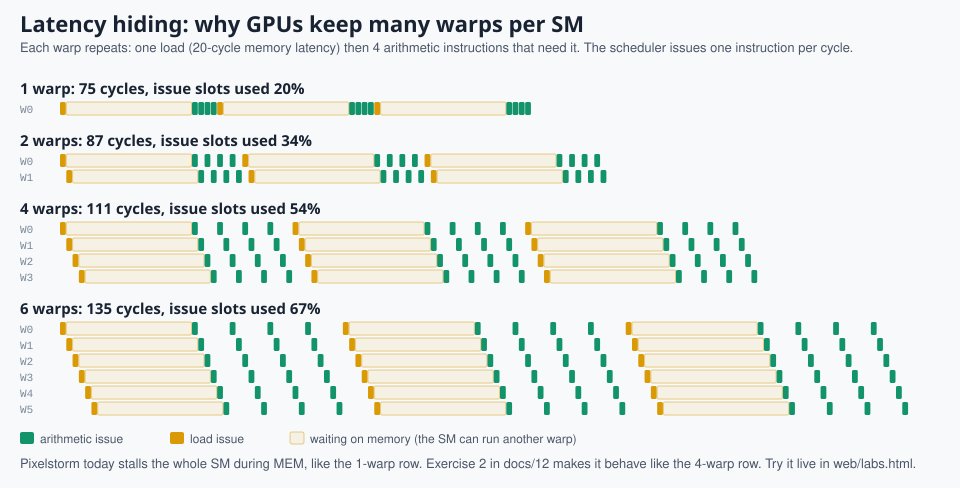

# 12. Make it better

> **Part 5: Build on it**, chapter 12 of 16. About 30 minutes.

**In this chapter you will learn**

- nine concrete improvements, each one a real idea in commercial GPUs
- how to measure whether your change helped
- open research questions you can explore with this code

**See it live:** [Latency hiding lab](https://normansrule.github.io/pixelstorm-gpu/labs.html#latency); [Occupancy lab](https://normansrule.github.io/pixelstorm-gpu/labs.html#occupancy)

---

Pixelstorm is a starting point. Each exercise below fixes a limitation you can *see* in the visualizer, and each maps to a real idea in commercial GPUs. Keep `make test` green: change the golden model in `web/js/pixelstorm.js` and the RTL together, and the cycle-exact comparison tells you when they drift apart.

## 1. Pipeline the SM

Today each instruction takes 5 cycles minimum because the FSM (Finite State Machine) runs SCHED, FETCH, DECODE, EXEC, WB in series. Split them into pipeline registers so a new instruction can start every cycle.

- Pick a *different warp* each cycle (barrel processing, like the early NVIDIA Tesla SMs) and you avoid most hazards: two instructions from the same warp are never in flight together.
- Measure: instructions per cycle (IPC) in the stats bar should rise from about 0.2 toward 1.0 per SM.

## 2. Hide memory latency

*What exercise 2 buys you, computed by the same model as the latency lab.*

While a warp waits in MEM, the whole SM waits. Let the scheduler issue other warps instead:

- Add a per-warp "waiting on memory" bit and a small queue of outstanding requests.
- Add a *scoreboard*: a bit per register that is set while a load is outstanding; a warp can keep issuing until it reads a register that is still pending.
- Experiment: increase DRAM latency to 100 cycles (`--lat 100`) and compare speedups with 1, 2 and 4 warps per SM. This is the occupancy trade-off.

## 3. Add a cache

Add a small direct-mapped L1 data cache in front of the arbiter. `07_matmul` re-reads the same `A` row eight times; watch hit rate and cycles fall. Then think about coherence: what happens when two SMs cache the same line and one writes it? (Real GPUs mostly sidestep this: L1 is write-through and not coherent, and the L2 is shared.)

## 4. Real floating point

Replace `QMUL` with an IEEE-754 single-precision fused multiply-add (FFMA) unit. Start combinational, then pipeline it over 4 cycles, which forces you to deal with multi-cycle execution latency in the scheduler.

## 5. A tiny tensor core

Add an `MMA` instruction that multiplies a 4x4 tile held across the lanes of a warp (each lane holds 2 elements) and accumulates into registers, in the spirit of PTX `mma.sync`. Rewrite `07_matmul` with it and compare instruction counts.

## 6. More atomics and memory ordering

Add `ATOM.MAX`, `ATOM.CAS` (compare-and-swap) and a `MEMBAR` fence. With CAS you can build a lock; with two SMs you can then build a test that fails without the fence.

## 7. Better divergence handling

- Implement a reconvergence stack with explicit `SSY`/`SYNC` instructions and compare SIMD efficiency with min-PC on `03_divergence`.
- Research direction: dynamic warp formation or thread block compaction (see [14-references.md](14-references.md)).

## 8. Several blocks per SM

Let an SM hold two 16-thread blocks at once (per-block barrier state, per-block shared memory base). This is how real GPUs keep enough warps resident to hide latency.

## 9. Toward silicon

- `yosys -p "read_verilog -Irtl -DSYNTHESIS rtl/*.v; synth -top ps_gpu_top; stat"` gives a gate count. The register file dominates: replace the flip-flop array with SRAM (Static RAM) macros.
- The design is small enough, once shrunk, to explore on open flows such as OpenLane with the SkyWater 130 nm process, or on an FPGA (Field-Programmable Gate Array) board.

## Research questions worth asking

1. How does SIMD efficiency change with warp size 4, 8, 16 on the same kernels? (Change `WARP_SIZE` and `warpSize` together.)
2. At what DRAM latency does adding a second SM stop helping, given one arbiter port?
3. What is the energy cost of fetching and decoding per useful lane operation? That ratio is the core argument for SIMT.
4. Can a compiler reorder code so min-PC reconvergence is always as early as a stack-based scheme?

<!-- chapter-footer -->

## Check yourself

Memory latency is 24 cycles and each load is followed by 4 arithmetic instructions. About how many warps hide the latency?

Roughly latency / (instructions per load) + 1 = 24 / 5 + 1, so about 6 warps. Check it in the latency hiding lab.

Which single exercise raises IPC (Instructions Per Cycle) most for arithmetic-heavy kernels?

Pipelining the SM (exercise 1): it moves from one instruction every 5 cycles toward one per cycle.

---

[Previous: 11. Graphics: pixels, triangles and fractals](11-graphics.md) | [Course map](00-start-here.md) | [Next: 13. From Pixelstorm to a real GPU](13-real-world-gpus.md)
