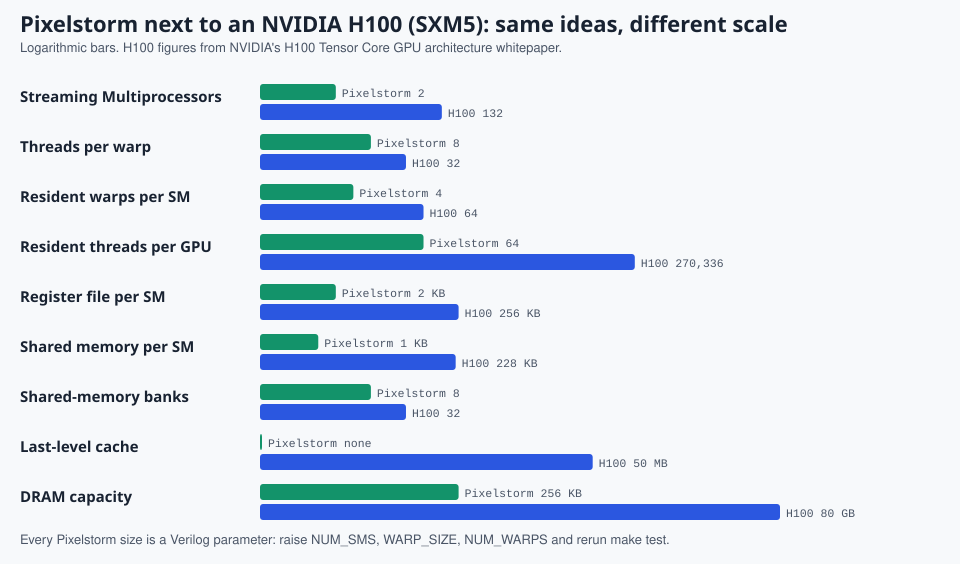

# 13. From Pixelstorm to a real GPU

> **Part 5: Build on it**, chapter 13 of 16. About 15 minutes.

**In this chapter you will learn**

- how to recognize the parts on a real graphics card and in a die photo
- how Pixelstorm's numbers compare with an NVIDIA H100
- which profiler metrics match what you have seen here, and how to read real SASS

**See it live:** [Occupancy lab with real GPU limits](https://normansrule.github.io/pixelstorm-gpu/labs.html#occupancy)

---

This page connects every block in Pixelstorm to the part of a real graphics card or data-center GPU that does the same job, so you can look at a photo of a GPU and know what you are seeing.

## What you see when you open a graphics card

| Physical part | What it is | Pixelstorm equivalent |
|---|---|---|
| The large square chip under the cooler | the GPU die: all SMs, caches, schedulers | `ps_gpu_top.v` |
| Chips arranged around it on the board (GDDR) or stacked beside it in the package (HBM, High Bandwidth Memory) | DRAM (Dynamic Random-Access Memory), the "global memory" | the DRAM model in `sim/tb_gpu.v` |
| Power stages (voltage regulators) around the chip | deliver hundreds of amps at about 1 V | not modelled |
| PCIe (Peripheral Component Interconnect Express) edge connector | link to the host CPU; kernels and data arrive this way | the host driver in `sim/tb_gpu.v` |
| NVLink bridge or connector | GPU-to-GPU link in servers | not modelled (a good exercise: two `ps_gpu_top` instances) |

## Inside the die



*Pixelstorm parameters next to an H100.*


A die photo ("die shot") shows a repeating grid of identical tiles. Each tile is an SM (Streaming Multiprocessor, NVIDIA) or CU (Compute Unit, AMD). The regular stripes in the middle are the L2 cache; the edges are memory controllers and I/O (Input/Output).

| Real block | Real size (NVIDIA H100, SXM5) | Pixelstorm |
|---|---|---|
| SMs | 132 enabled | 2 (`NUM_SMS`) |
| Lanes per warp | 32 | 8 (`WARP_SIZE`) |
| Resident warps per SM | up to 64 | 4 (`NUM_WARPS`) |
| Register file per SM | 256 KB | 2 KB |
| Shared memory / L1 per SM | up to 228 KB shared, 256 KB combined | 1 KB (256 words) |
| Shared-memory banks | 32 | 8 |
| L2 cache | 50 MB | none |
| DRAM | 80 GB HBM3, about 3 TB/s | 256 KB model, one request at a time |
| Warp schedulers per SM | 4 (one per SM sub-partition) | 1 |
| Tensor Cores | 4 per SM | none (exercise 5) |

Figures are from NVIDIA's H100 Tensor Core GPU architecture whitepaper; check it for exact values for other products.

## Where the ideas in this repo show up in practice

- **Coalescing (docs/08):** NVIDIA's profiler, Nsight Compute, reports "sectors per request". 4 sectors of 32 bytes per request for 32 lanes reading consecutive 4-byte floats is the ideal, exactly the 2-transactions-for-8-lanes case here scaled up.
- **Bank conflicts (docs/08):** Nsight Compute reports shared-memory bank conflicts per instruction, the same count the Pixelstorm load/store unit shows as "bank passes".
- **Divergence (docs/07):** Nsight Compute's "branch efficiency" and "warp execution efficiency" are the SIMD efficiency number in the visualizer's stats bar.
- **Occupancy (docs/12, exercise 2):** the CUDA Occupancy Calculator in Nsight Compute answers "how many warps can sit on one SM", which decides how well memory latency is hidden.
- **SASS (docs/02):** run `cuobjdump -sass` on any compiled CUDA program and you will see `S2R`, `IMAD`, `ISETP`, `LDG`, `STG`, `BAR.SYNC`, `SHFL`, `VOTE`: the instructions Pixelstorm's ISA is modelled on.

## Try it on a real GPU

If you have an NVIDIA card (any GeForce from the last decade works, including in WSL2 with the Windows driver):

```bash
sudo apt install -y nvidia-cuda-toolkit      # or the CUDA toolkit from NVIDIA's site
cat > vadd.cu <<'CU'
__global__ void vadd(const int* A, const int* B, int* C, int n) {
    int i = blockIdx.x * blockDim.x + threadIdx.x;
    if (i >= n) return;
    C[i] = A[i] + B[i];
}
CU
nvcc -cubin -arch=sm_86 vadd.cu -o vadd.cubin && cuobjdump -sass vadd.cubin
```

Compare the output line by line with `node tools/pixelstorm.js asm kernels/01_vector_add.psa`. Change `sm_86` to your card's compute capability (for example `sm_75` for Turing, `sm_89` for Ada, `sm_90` for Hopper).

<!-- chapter-footer -->

## Check yourself

<details>
<summary>Which Nsight Compute metric corresponds to Pixelstorm's bank passes?</summary>

"Shared memory bank conflicts" (per instruction or per request).

</details>

<details>
<summary>How many SMs does an H100 SXM5 have enabled, and how many lanes per warp?</summary>

132 SMs, 32 lanes per warp.

</details>


---

[Previous: 12. Make it better](12-make-it-better.md) | [Course map](00-start-here.md) | [Next: 14. References](14-references.md)
