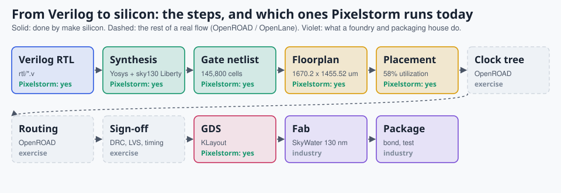
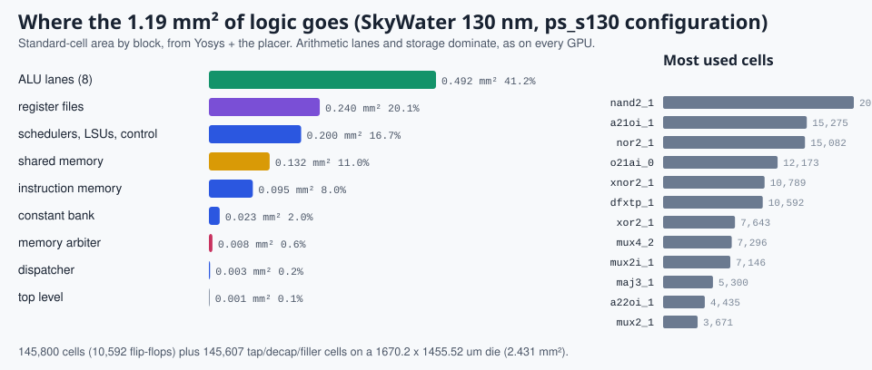
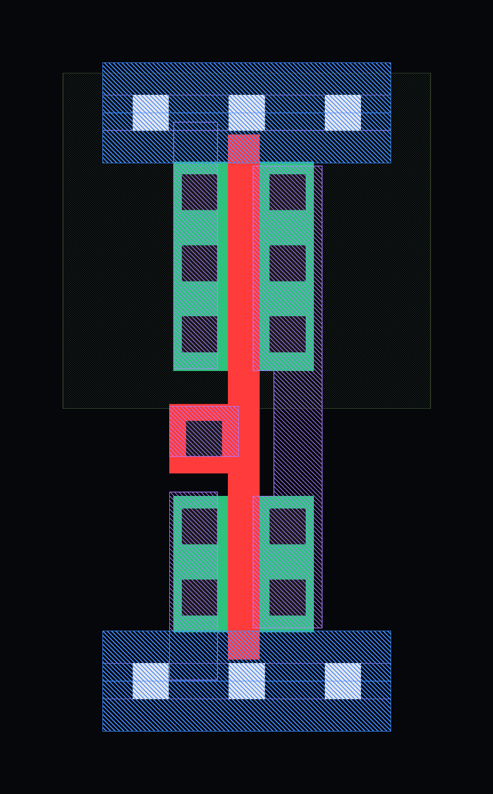
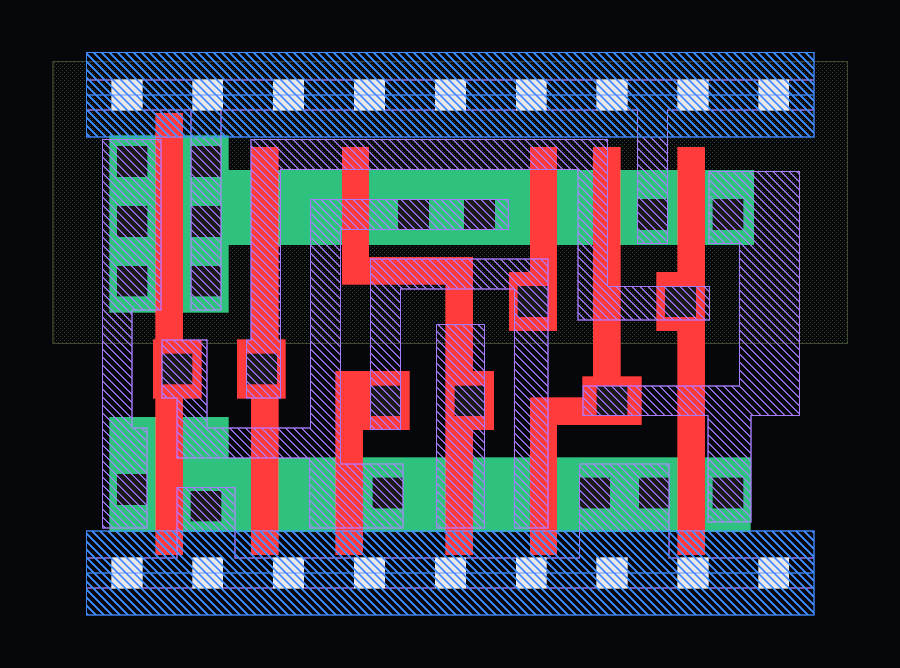
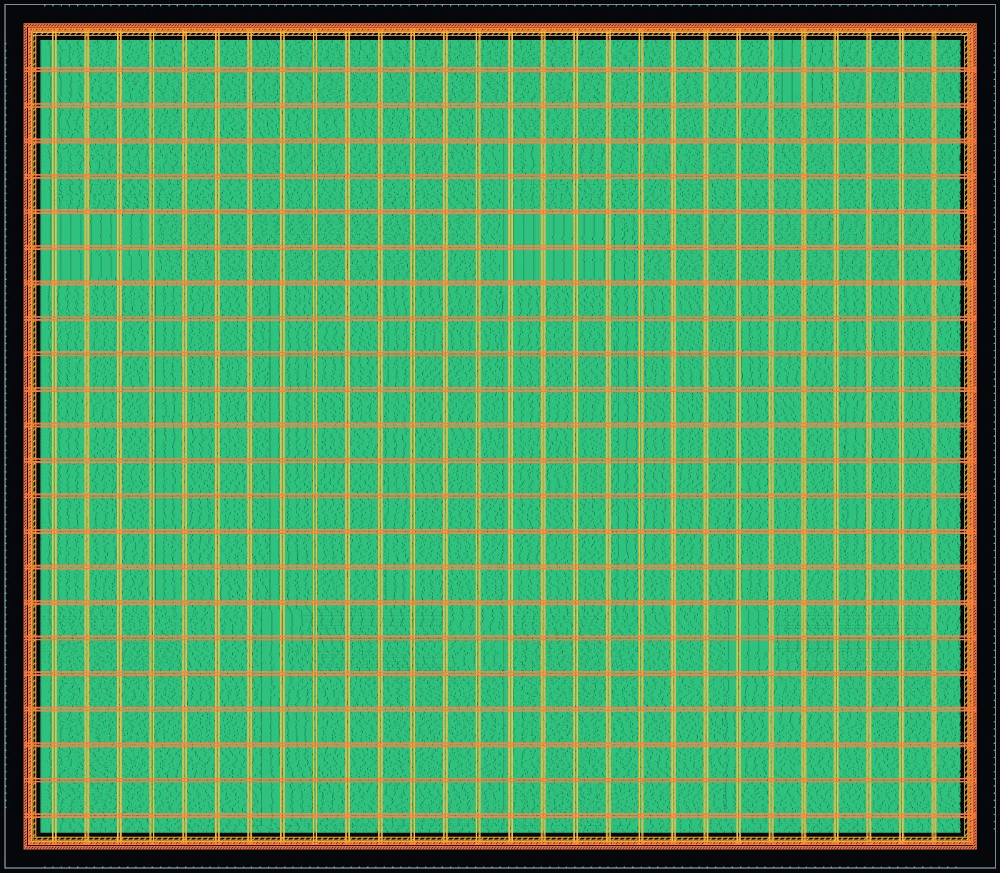
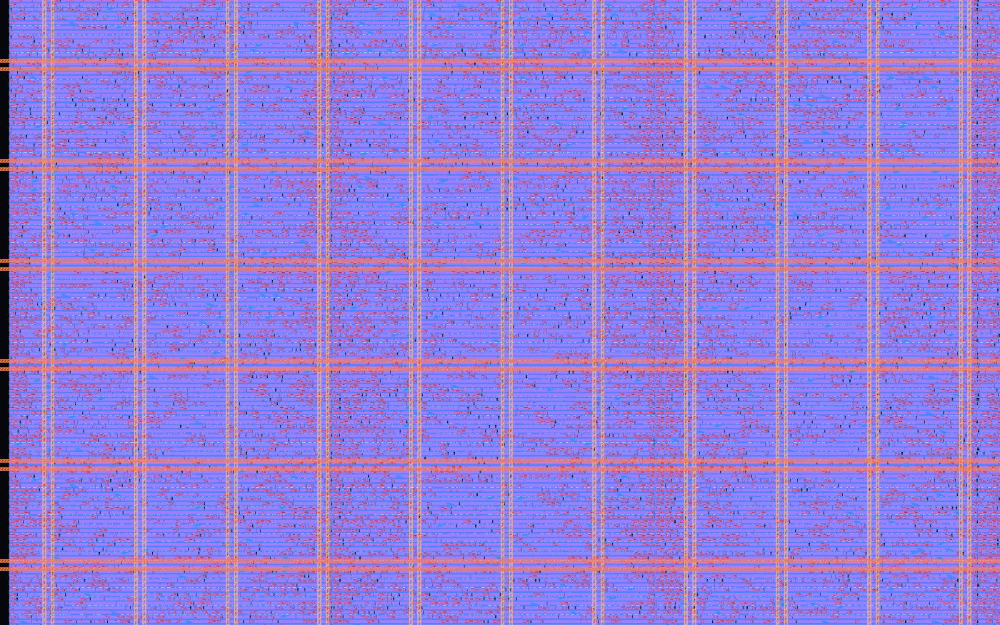
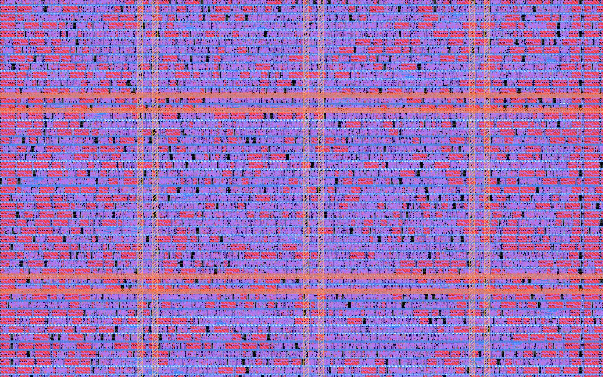
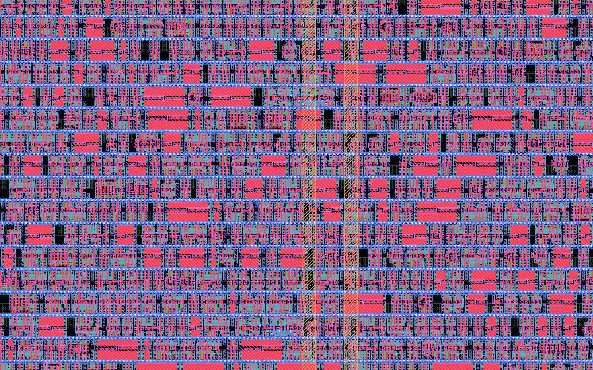
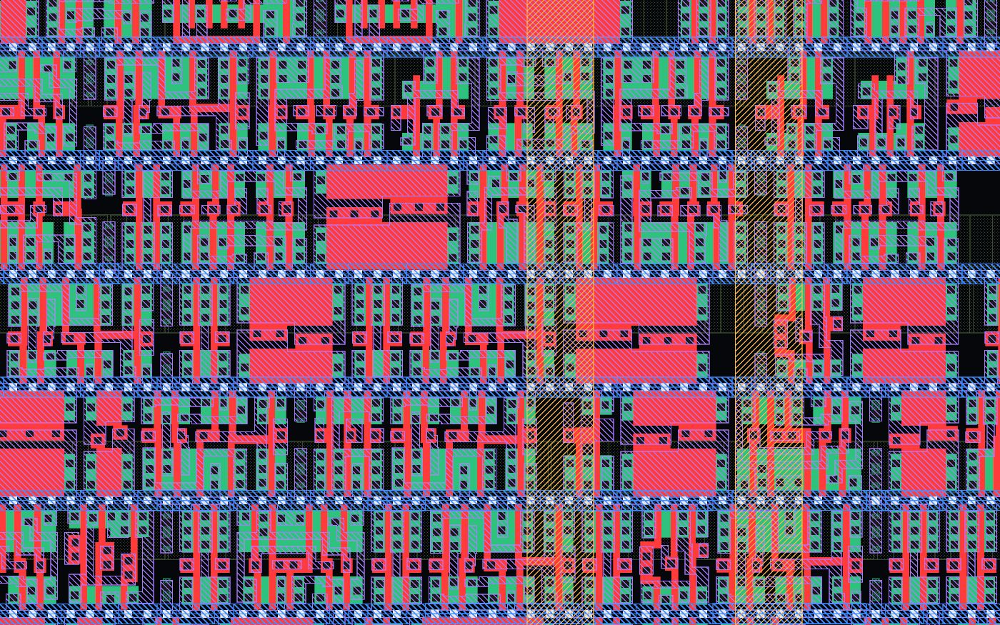

# 14. From Verilog to silicon

> **Part 5: Build on it**, chapter 14 of 17. About 35 minutes.

**In this chapter you will learn**

- how the same Verilog becomes 145,800 real SkyWater 130 nm standard cells and 1.38 million transistors
- what a standard cell, a placement row and a GDS layout are, and how to read one in KLayout
- which steps of a real tapeout Pixelstorm runs, and how to finish the rest with OpenROAD

**See it live:** [Silicon page: die, zoom from die to transistor, 3D standard cells](https://normansrule.github.io/pixelstorm-gpu/silicon.html); Command line: make silicon && make gds

---



Everything so far has been simulation: Verilog running inside Icarus Verilog. A real GPU is geometry: polygons of silicon, polysilicon and metal that a foundry prints onto a wafer. This chapter takes the **same Verilog** through the first half of a real physical-design flow, onto a real open process: SkyWater 130 nm, the process behind Tiny Tapeout and the efabless shuttles. One command does it:

```bash
make silicon      # fetch the PDK, synthesize, place, write GDS, render with KLayout
make gds          # open the layout in KLayout
```

## The tapeout configuration

In simulation, every register and memory word is free. In silicon, each storage bit here is a flip-flop of 24 transistors plus the multiplexers that read it. Real GPUs keep register files and shared memory in dense SRAM (Static Random-Access Memory) macros; an open flow without SRAM macros has to shrink the memories instead. `tools/silicon/ps_s130_top.v` instantiates the unchanged `rtl/ps_gpu_top.v` with smaller parameters:

| Parameter | Simulated GPU | ps_s130 (silicon) |
|---|---|---|
| Streaming Multiprocessors | 2 | 2 |
| Warps per SM x lanes per warp | 4 x 8 | 2 x 4 |
| Registers per thread | 16 | 8 |
| Shared memory per SM | 256 words, 8 banks | 32 words, 4 banks |
| Instruction memory | 1,024 words | 64 words |

## Results

| | |
|---|---|
| Process | SkyWater 130 nm, `sky130_fd_sc_hd` high-density cells, typical corner (25 °C, 1.80 V) |
| Logic cells | **129,171** standard cells, of which 10,592 are flip-flops |
| Transistors | **1,367,810** in the logic, counted from the layout (every place polysilicon crosses diffusion) |
| Cell area | 1,197,396 µm² |
| Die | 1672.04 x 1458.24 µm = **2.438 mm²**, core utilization 57.7% |
| Physical-only cells | 137,468 tap, decap and filler cells |
| I/O pins | 441 |

For scale: an NVIDIA H100 is about 814 mm² with 80 billion transistors in a 4 nm-class process, roughly 58,000 times Pixelstorm's transistor count.



## Standard cells: where the transistors are

A synthesis tool does not draw transistors. It picks from a **standard-cell library**: a few hundred pre-drawn, pre-characterized gates, all the same height (2.72 µm in sky130 high density) so they tile into rows. Here are five of the cells Pixelstorm uses, exactly as KLayout draws them from the library:

| NAND2 (4 transistors) | Inverter (2) | 2:1 mux (12) | Full adder (28) | D flip-flop (24) |
|---|---|---|---|---|
|  |  |  |  |  |

How to read them:

| Colour | Layer (GDS number) | What it is |
|---|---|---|
| green | diff (65/20) | diffusion: the silicon that becomes transistor source and drain |
| red | poly (66/20) | polysilicon: **a transistor is wherever red crosses green**, the red being its gate |
| dark squares | licon (66/44) | contacts from diffusion and poly up to local interconnect |
| violet hatch | li1 (67/20) | local interconnect, sky130's lowest wiring layer |
| light squares | mcon (67/44) | contacts from li1 to metal 1 |
| blue hatch | met1 (68/20) | metal 1: the power rails along the top (VPWR) and bottom (VGND) of every cell |
| amber, orange | met4, met5 (71/20, 72/20) | the chip's power grid |

The top half of each cell sits in an n-well and holds the PMOS (p-type) transistors; the bottom half holds the NMOS (n-type) ones. That is CMOS (Complementary Metal-Oxide-Semiconductor) logic: every gate is a pull-up network of PMOS and a pull-down network of NMOS.

## The layout


`tools/silicon/place.py` does the job of a placer in five steps:

1. **Flatten.** Walk the Yosys netlist, give each of the 129,171 cells a global instance, and attribute it to a block. Register-file and shared-memory flip-flops are recognized by their net names (`rf`, `smem`); other logic joins the block it is most connected to.
2. **Floorplan.** Size a rectangle for each block at a target utilization and slice the die: instruction memory on top, each SM as a register file, four ALU lanes and a control and shared-memory band, and the arbiter at the bottom.
3. **Global placement.** Ten rounds of force-directed placement: each cell moves toward the centroid of the nets it touches, then cells are re-spread so no region over-fills.
4. **Legalization.** Snap every cell into real rows: 0.46 µm sites, 2.72 µm rows, alternating orientation so neighbouring rows share a power rail. Then fill every gap with tap cells (every 13.8 µm), decap cells and fillers, as a real flow does.
5. **GDS.** Write the layout with instances of the real sky130 cell layouts, a power ring and stripes on metal 4 and metal 5, a die boundary, and 441 I/O pins named after the Verilog ports.

It stops before **clock-tree synthesis, routing and sign-off** (DRC, Design Rule Checking; LVS, Layout Versus Schematic; static timing analysis). The cells are placed, not yet wired to each other. Finishing the job is the exercise at the end of this chapter.

### A dive from die to transistor

| | |
|---|---|
|  |  |
| the whole die, 1.7 mm across | 600 µm: SM 0's ALU lanes under the power grid |
|  |  |
| 200 µm: rows of cells become visible | 70 µm: individual cells, decaps (large red squares), metal-1 rails |
|  |  |
| 24 µm: a few dozen gates | 9 µm: single transistors, where red poly crosses green diffusion |

The website's silicon page animates this dive and lets you spin individual cells in 3D.

## Open it in KLayout

```bash
sudo apt install -y klayout          # the desktop app (Ubuntu package)
make silicon                          # writes build/silicon/ps_s130.gds
klayout build/silicon/ps_s130.gds
```

- Choose **Display, Full Hierarchy** (Shift+F2 in recent versions) so KLayout draws inside every cell instance, not just their outlines.
- The layer panel on the right toggles layers. Turn off `li1` and `met1` to see diffusion and poly underneath.
- Layer `250/0` holds the floorplan rectangles and `250/1` their names; switch them on to see the blocks.
- Double-click an instance to descend into a standard cell.

The same GDS is built in GitHub Actions (`.github/workflows/silicon.yml`) and attached to every release, so anyone can download it without installing anything.

## Finish the flow: routing with OpenLane

OpenLane 2 wraps OpenROAD (floorplan, placement, clock tree, routing), Magic and KLayout (DRC, GDS) and Netgen (LVS) into one flow. A starting configuration is in `tools/silicon/openlane/config.json`:

```bash
python3 -m pip install openlane                     # OpenLane 2; runs the tools in Docker or Nix
cd tools/silicon/openlane
openlane --dockerized config.json                   # a long run: tens of minutes to hours
```

What the run teaches: a 40 ns clock (25 MHz) is comfortable, the multipliers set the critical path, and the flip-flop register files dominate routing congestion. That last lesson is the one real GPU designers live by: memory, not arithmetic, decides the layout. The natural next steps are SRAM macros for the register file (OpenRAM, or the sky130 SRAM macros) and a smaller configuration that fits a Tiny Tapeout tile.

## Real chips to compare with

The repeating tiles in an NVIDIA or AMD die shot are SMs or CUs laid out exactly this way, just far denser. Places to look at the real thing:

- **Die shots.** The photographer Fritzchens Fritz publishes high-resolution GPU and CPU die shots on Flickr, many in the public domain; TechPowerUp's GPU database shows the die of most graphics cards.
- **Open layouts.** The Tiny Tapeout GDS viewer (linked from tinytapeout.com) shows real fabricated sky130 designs in 3D in the browser.
- **Tools.** KLayout (klayout.de), OpenROAD (theopenroadproject.org), OpenLane 2 (openlane2.readthedocs.io), and the SkyWater PDK documentation (skywater-pdk.readthedocs.io).
- **Courses.** Matt Venn's Zero to ASIC course walks this exact flow on sky130, and his YouTube channel (in English) shows Tiny Tapeout chips coming back from the fab.

<!-- chapter-footer -->

## Check yourself

<details>
<summary>Why does the tapeout configuration use 2 warps of 4 lanes and 8 registers instead of the simulated 4 x 8 x 16?</summary>

Every storage bit becomes a flip-flop (about 24 transistors) plus multiplexers to read it. A full-size register file with 24 read ports would be hundreds of thousands of cells. Real chips use dense SRAM macros for that; without them, the design has to shrink.

</details>

<details>
<summary>In a standard cell, where exactly is a transistor?</summary>

Wherever a polysilicon line (red) crosses a diffusion region (green). The poly is the gate; the diffusion on either side is source and drain. Counting those crossings gives 4 for a NAND2 and 28 for a full adder.

</details>

<details>
<summary>The layout has 145,607 extra tap, decap and filler cells. What are they for?</summary>

Taps tie the wells to power so the chip does not latch up; decaps are capacitors that steady the supply when many gates switch at once; fillers keep the rows continuous for manufacturing. A real flow inserts all three.

</details>


---

[Previous: 13. From Pixelstorm to a real GPU](13-real-world-gpus.md) | [Course map](00-start-here.md) | [Next: 15. References](15-references.md)
