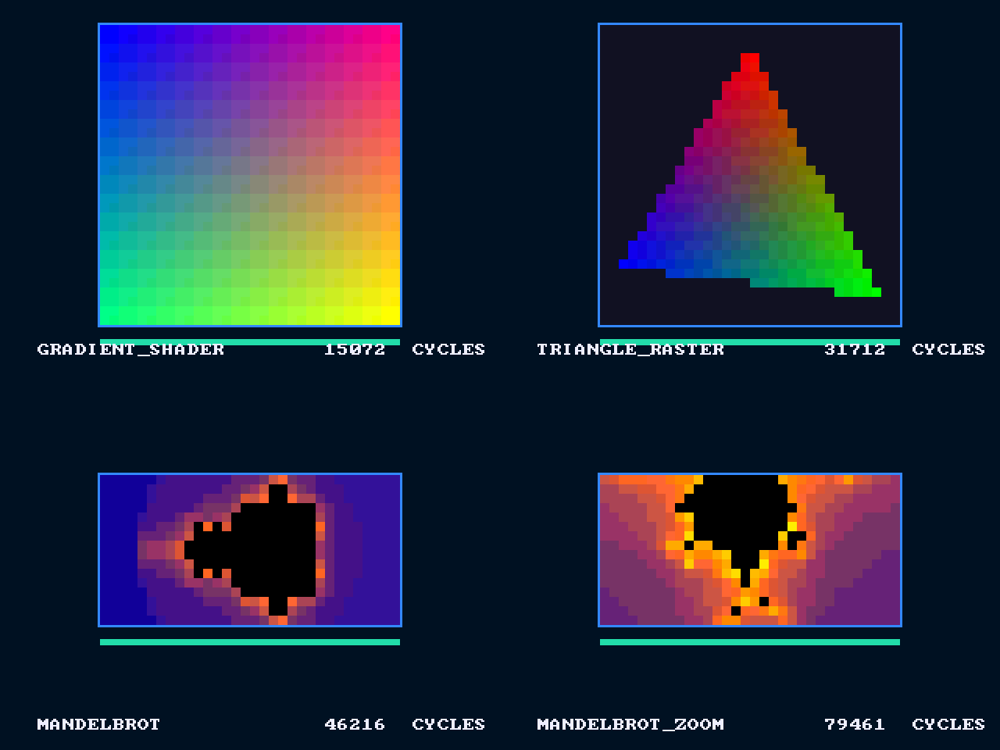

# 15. Pixelstorm on an FPGA

> **Part 5: Build on it**, chapter 15 of 18. About 40 minutes.

**In this chapter you will learn**

- how the same Verilog becomes a GPU running on a real FPGA board, drawing to a VGA monitor
- why a register file written for simulation can need 164,000 FPGA LUTs, and how banking it per lane fixes that
- how to build, load and run it on a Digilent Nexys A7-100T or Basys 3, and how the board simulation proves it works first

**See it live:** Board simulation: make fpga-sim; Datasheet: fpga/docs/pixelstorm-fpga-datasheet.pdf

---



A field-programmable gate array (FPGA) is a chip full of small lookup tables (LUTs), flip-flops, block RAMs and multipliers that you can wire into any circuit by loading a configuration file, the **bitstream**. Loading Pixelstorm's Verilog into one turns a board costing as little as **about $30** into a real, working GPU: press a button, and a monitor shows the image appearing as the warps compute it, with the kernel name and its cycle count written underneath.

**Which board?** See [fpga/docs/BUYING.md](../fpga/docs/BUYING.md). In short: the **Sipeed Tang Nano 20K** (about $30 on Amazon, HDMI, fully open-source tools) for anyone; the **Digilent Basys 3** for labs that use Vivado; the **Nexys A7-100T** for the full-width GPU.

Everything for this lives in `fpga/`, and the datasheet is `fpga/docs/pixelstorm-fpga-datasheet.pdf`.

## What goes on the chip

| Block | File | Role |
|---|---|---|
| GPU core | `rtl/ps_gpu_top.v` (unchanged) | 1 SM, 4 warps x 8 lanes (Nexys A7) or 8 warps x 4 lanes (Basys 3) |
| Global memory | `fpga/rtl/ps_bram_mem.v` | 32 KB of block RAM, same request/response protocol as the simulation's DRAM model, second port for video |
| Loader | `fpga/rtl/ps_loader.v` | the "driver" in hardware: clears the framebuffer, copies a kernel from ROM into instruction memory and the constant bank, launches it |
| VGA | `fpga/rtl/ps_vga.v` | 640x480 at 60 Hz, draws the framebuffer 12 times larger, progress bar amber while running and green when done |
| Status line | `fpga/rtl/ps_vga.v` | kernel name and the cycle count in decimal, drawn with an 8x8 font ROM (public-domain font8x8); the binary count is converted by a small double-dabble circuit |
| UART | `fpga/rtl/ps_uart_tx.v` | prints `PIXELSTORM k=<slot> cycles=<hex>` at 115200 baud when a kernel finishes |
| HDMI | `fpga/rtl/ps_tmds_enc.v` | TMDS encoder (the 8b/10b code of DVI and HDMI); the Tang Nano wrapper serializes it with Gowin OSER10 blocks |
| Clocking | `fpga/boards/clocking_xc7.v` | 100 MHz oscillator to 25 MHz with an MMCM (mixed-mode clock manager); the GPU clock goes through a BUFGCE (a clock buffer with enable) for slow motion |

The loader's ROM holds four kernels, chosen with the two lowest switches: the gradient shader, the triangle rasterizer, the Mandelbrot set, and the Mandelbrot set again with **different kernel arguments only** (the view zooms onto the top bulb). The two highest switches slow the GPU clock to 1/64, 1/1024 or 1/16384: at 1/1024 the Mandelbrot kernel takes about two seconds and you can watch it paint row by row.

## The lesson: a register file written for simulation does not fit

The first synthesis of the FPGA configuration asked for **164,482 LUTs** and 26,447 flip-flops, two and a half times a Nexys A7-100T. The arithmetic was not the problem (80 DSP slices is fine). The storage was: the register file was one big array read by 24 ports at once (8 lanes x 3 operands), so synthesis built it from flip-flops and a forest of multiplexers.

But lane `g` only ever reads and writes the registers of threads `w*WARP_SIZE + g`. So the register file was split into **one small bank per lane**, and shared memory into **one small RAM per bank** (the bank-conflict logic already guarantees each bank serves one word per pass). Nothing a program can see changed, and `./pixelstorm test` proves it cycle for cycle. The result:

| GPU core, Artix-7 | One big register file | Banked per lane |
|---|---|---|
| LUTs (including distributed RAM) | 164,482 | **30,508** |
| Flip-flops | 26,447 | **1,807** |
| DSP48E1 | 80 | 80 |

Each lane's bank is now a handful of RAM64M primitives: small multi-port memories built into the FPGA's LUTs. Real GPUs bank their register files the same way, for the same reason.

## Which board

| | Tang Nano 20K | Basys 3 | Nexys A7-100T |
|---|---|---|---|
| Price | about $30 ([Amazon](https://www.amazon.com/dp/B0C5XJV83K)) | about $150 to $200 ([Amazon](https://www.amazon.com/dp/B00NUE1WOG)) | about $300 to $350 (Digilent) |
| FPGA | Gowin GW2AR-18 (20,736 LUT4) | Artix-7 XC7A35T (20,800 LUT6) | Artix-7 XC7A100T (63,400 LUT6) |
| GPU build | 1 SM, 16 warps x 2 lanes | 1 SM, 8 warps x 4 lanes | 1 SM, 4 warps x 8 lanes |
| Core LUTs (estimate) | reported by `make fpga-tang` (see below) | 15,032 of 20,800 (72%) | 30,508 of 63,400 (48%) |
| Video | HDMI | VGA | VGA |
| Tools | open source (OSS CAD Suite) | Vivado ML Standard | Vivado ML Standard |
| Mandelbrot | 154,252 cycles (6.1 ms) | 81,661 cycles (3.3 ms) | 46,216 cycles (1.8 ms) |
| Board reference | [BOARD-tangnano20k.md](../fpga/docs/BOARD-tangnano20k.md) | [BOARD-basys3.md](../fpga/docs/BOARD-basys3.md) | [BOARD-nexys-a7.md](../fpga/docs/BOARD-nexys-a7.md) |

All three builds keep 32-thread blocks, so every demo kernel runs unchanged; fewer lanes simply means more warps take turns, which is the SIMT trade-off from chapter 2 made visible: the 2-lane GPU does the same work in about 3.3 times the cycles. The estimates come from Yosys (`synth_xilinx`); Vivado's own `utilization.rpt` after `make fpga-bit` is authoritative.

## Simulate the board first

```bash
make fpga-sim
```

It runs three checks: the TMDS encoder against a reference decoder (every symbol of 30 video lines, control tokens, DC balance), the full board on the Nexys/Basys GPU shape, and the full board on the Tang Nano's 16 x 2 shape.

This runs the **entire FPGA design** in Icarus Verilog for each ROM slot: press start, wait for done, then grab one full VGA frame from the video pins, exactly what a monitor would receive. `fpga/sim/check.js` compares every framebuffer pixel on that screen (left edge, centre and right edge of each magnified pixel) with the golden model, and the testbench decodes the UART line:

| Kernel | GPU cycles | Time at 25 MHz | UART | Pixels |
|---|---|---|---|---|
| gradient_shader | 15,072 | 0.60 ms | `PIXELSTORM k=0 cycles=00003AE0` | 1,024 match |
| triangle_raster | 31,712 | 1.27 ms | `PIXELSTORM k=1 cycles=00007BE0` | 1,024 match |
| mandelbrot | 46,216 | 1.85 ms | `PIXELSTORM k=2 cycles=0000B488` | 512 match |
| mandelbrot_zoom | 79,461 | 3.18 ms | `PIXELSTORM k=3 cycles=00013665` | 512 match |

The same job runs in GitHub Actions on every push.

## Build and run on hardware

**Tang Nano 20K (open source):** install the OSS CAD Suite, then `make fpga-tang`. Read its utilisation report first: the 2-lane GPU is the tightest fit of the three (its resource use could not be measured on the 4 GB machine that built this release, where Yosys ran out of memory), and the demo build already trims shared memory to 64 words, which no demo kernel uses. If nextpnr reports more than 100% of the LUT4s, the Basys 3 build is the fallback. It runs Yosys, nextpnr-himbaechel and gowin_pack and loads the bitstream with openFPGALoader. Plug an HDMI cable into any monitor or TV, press S2 to pick a kernel and S1 to run it.

**Basys 3 and Nexys A7 (Vivado):** Vivado ML Standard (the free edition) supports both FPGAs. On Windows, install it natively and point it at the repository through `\\wsl$\...`, or install the Linux version inside WSL:

```bash
make fpga-bit BOARD=nexys_a7          # or BOARD=basys3: synthesis, place, route, bitstream
make fpga-prog BOARD=nexys_a7         # load it over USB with openFPGALoader
# or: vivado -mode batch -source fpga/vivado/program.tcl -tclargs nexys_a7
```

Then plug in a VGA monitor, choose a kernel with the two lowest switches, press the centre button, and open the board's USB serial port at 115200 baud to read the status line. Read `build/fpga/<board>/timing.rpt` first: a negative slack means the GPU cannot run at 25 MHz as built, and chapter 12's pipelining exercise is the fix.

## Further

- **Real DDR memory.** Replace `ps_bram_mem` with a DDR2 controller (the Nexys A7 has 128 MiB); the GPU does not change, because it only sees the request/response port.
- **Two SMs.** The Nexys A7 has room for a second SM once the register banks are in LUTRAM; try `NUM_SMS(2)` in the wrapper and read the utilization report.
- **Upload kernels at run time.** Add a UART receiver to the loader so `./pixelstorm` can send any assembled kernel to the board.
- **HDMI on other boards.** `ps_tmds_enc.v` is board-independent; boards with HDMI (such as the ULX3S or the Arty with a Pmod) need only their own serializer primitives, as the Tang Nano wrapper shows.
- **Use the Tang Nano's SDRAM.** Its 64 Mb SDRAM could hold a 640x480 framebuffer; the GPU only sees the memory port.

<!-- chapter-footer -->

## Check yourself

<details>
<summary>The FPGA version keeps global memory in block RAM with the same request/response protocol as the DRAM model. Why keep the protocol?</summary>

Because the GPU does not change at all: ps_gpu_top talks to "memory" through one port, so swapping the testbench DRAM for block RAM (or for real DDR later) needs no change inside the GPU.

</details>

<details>
<summary>Mandelbrot takes 46,216 cycles on the board. How long is that at 25 MHz, and why is there a slow-motion switch?</summary>

About 1.8 milliseconds: faster than one video frame. Slowing the GPU clock to 1/1024 stretches it to about 1.9 seconds, so you can watch the warps paint.

</details>

<details>
<summary>Why does splitting the register file per lane not change any result?</summary>

Lane g only ever reads and writes the registers of threads w*WARP_SIZE+g. Giving each lane its own bank keeps every access identical; ./pixelstorm test proves it cycle for cycle.

</details>


---

[Previous: 14. From Verilog to silicon](14-silicon.md) | [Course map](00-start-here.md) | [Next: 16. References](16-references.md)
